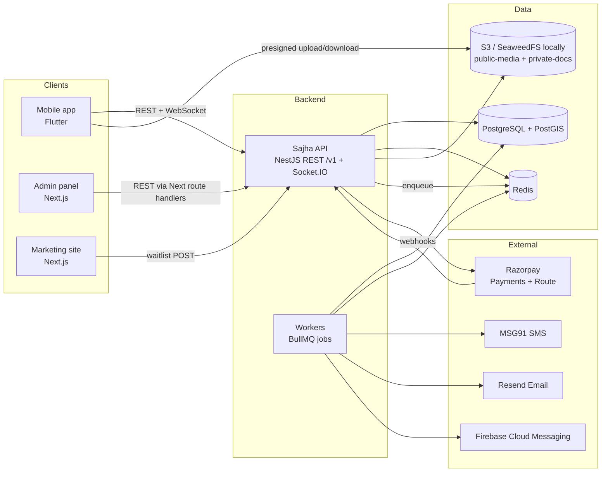
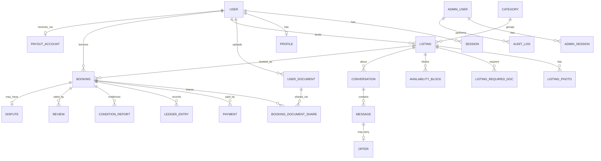
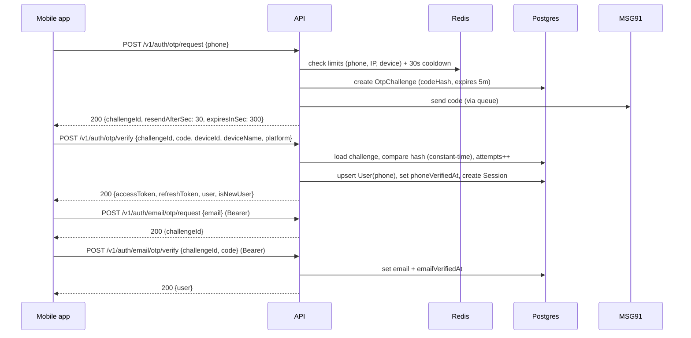
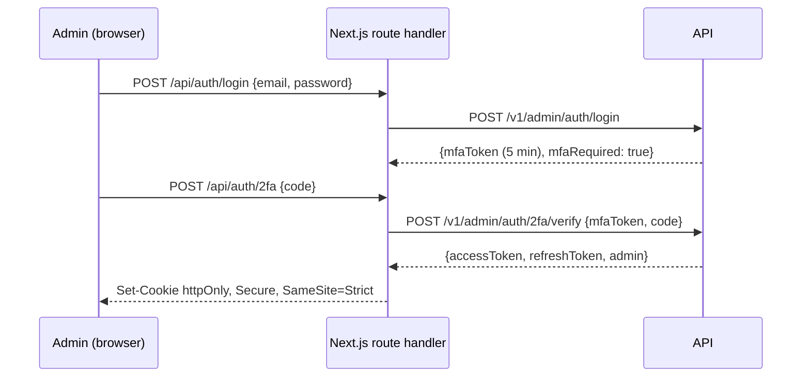
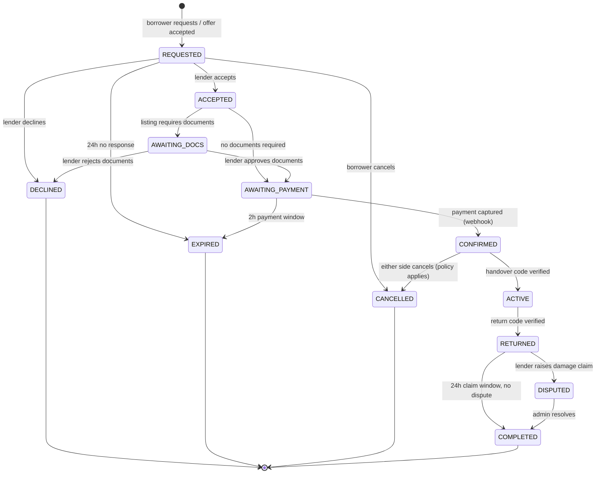
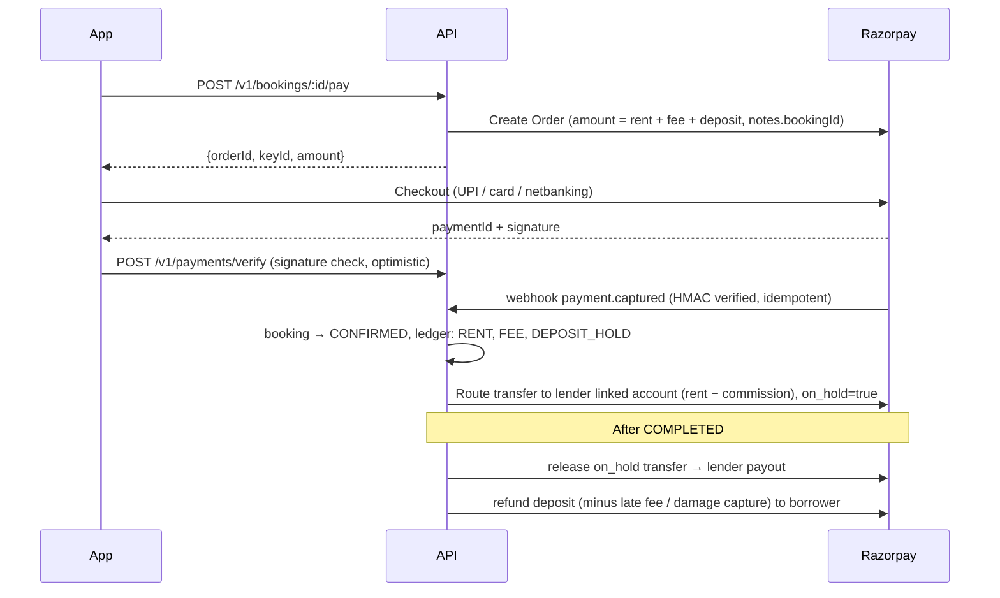
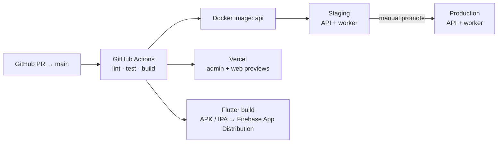

# Sajha — Architecture

System design for Sajha. For **what** we build, see the [PRD](./PRD.md). For the stack and conventions, see the [PLAN](./PLAN.md). For the build order, see [PHASES](./PHASES.md).

---

## 1. System context



- **One API** (a NestJS modular monolith) serves the mobile app, admin and web. Workers run as the same codebase in a separate process (`main.worker.ts`), so they scale independently.
- The **mobile app uploads files straight to S3** using presigned URLs; the API never proxies large files.
- **Admin** never stores tokens in the browser. Next.js route handlers keep the admin session in an `httpOnly` cookie and call the API server-to-server.

## 2. Backend module map (`apps/api/src`)

```
src/
├── main.ts                 # HTTP + WebSocket bootstrap
├── main.worker.ts          # BullMQ workers bootstrap
├── config/                 # typed, validated env config
├── common/                 # guards, decorators, filters, interceptors, pipes, utils
├── prisma/                 # PrismaService + raw SQL helpers
├── providers/              # sms/, email/, storage/, payment/, push/ (interface + impls + fakes)
└── modules/
    ├── auth/               # user auth: phone OTP, email OTP, tokens, sessions     (Phase 1a)
    ├── otp/                # OTP challenge create/verify, rate limits               (Phase 1a)
    ├── admin-auth/         # admin login, TOTP 2FA, admin sessions, RBAC            (Phase 1a)
    ├── users/              # user record, /me                                      (Phase 1a)
    ├── waitlist/           # marketing waitlist                                    (Phase 1d)
    ├── profiles/           # bio, avatar, location, badges                          (Phase 2)
    ├── documents/          # personal document vault                                (Phase 2)
    ├── categories/         #                                                        (Phase 3)
    ├── listings/           # CRUD, photos, pricing, required docs                   (Phase 3)
    ├── availability/       # blocked dates, availability queries                   (Phase 3)
    ├── media/              # presigned URLs, image processing jobs                  (Phase 3)
    ├── search/             # text + geo + date search                               (Phase 4)
    ├── favorites/          # wishlist                                               (Phase 4)
    ├── chat/               # conversations, messages, Socket.IO gateway              (Phase 5)
    ├── offers/             # offer / counter-offer                                   (Phase 5)
    ├── notifications/      # in-app + push/email/SMS fan-out                        (Phase 5)
    ├── bookings/           # booking state machine                                  (Phase 6)
    ├── booking-documents/  # booking-scoped document sharing                       (Phase 6)
    ├── payments/           # Razorpay orders, webhooks, refunds, ledger             (Phase 7)
    ├── payouts/            # Razorpay Route linked accounts, transfers              (Phase 7)
    ├── handover/           # handover/return codes, condition reports               (Phase 8)
    ├── reviews/            #                                                        (Phase 8)
    ├── disputes/           #                                                        (Phase 8)
    ├── reports/            # report user/listing                                    (Phase 8)
    ├── admin/              # admin-facing endpoints per area (/v1/admin/*)          (each phase)
    └── audit/              # audit log writer                                       (Phase 1a)
```

**Cross-cutting pieces**
- `JwtAuthGuard` (users), `AdminJwtGuard` + `@Roles()` (admins), `VerifiedGuard` (requires verified phone and email)
- `ThrottlerGuard` backed by Redis for general rate limits; dedicated OTP limiter
- Global `ValidationPipe` (whitelist, forbid unknown fields, transform)
- Global exception filter → `{ error: { code, message, details } }`
- `nestjs-pino` logging with a request ID; sensitive fields (OTP, tokens, phone) redacted
- `@nestjs/swagger` at `/docs` (disabled in production or behind basic auth)

## 3. Data model

### 3.1 Entity relationship overview



### 3.2 Phase 1 tables (detailed)

```prisma
model User {
  id               String    @id @db.Uuid            // UUID v7
  phone            String    @unique                 // E.164, e.g. +919876543210
  phoneVerifiedAt  DateTime?
  email            String?   @unique                 // stored lower-cased
  emailVerifiedAt  DateTime?
  name             String?
  status           UserStatus @default(ACTIVE)       // ACTIVE | SUSPENDED | BANNED | DELETED
  createdAt        DateTime  @default(now())
  updatedAt        DateTime  @updatedAt
  sessions         Session[]
}

model Session {                                      // one per device login
  id               String    @id @db.Uuid
  userId           String    @db.Uuid
  familyId         String    @db.Uuid                // refresh-token rotation family
  refreshTokenHash String    @unique                 // SHA-256 of opaque token
  deviceId         String
  deviceName       String?
  platform         String?                           // android | ios
  ip               String?
  userAgent        String?
  expiresAt        DateTime
  revokedAt        DateTime?
  replacedById     String?   @db.Uuid
  createdAt        DateTime  @default(now())
  lastUsedAt       DateTime  @default(now())
}

model OtpChallenge {
  id           String      @id @db.Uuid
  channel      OtpChannel                             // SMS | EMAIL
  purpose      OtpPurpose                             // LOGIN | VERIFY_EMAIL
  target       String                                 // phone or email
  userId       String?     @db.Uuid
  codeHash     String                                 // HMAC-SHA256(code, OTP_PEPPER)
  attempts     Int         @default(0)
  maxAttempts  Int         @default(5)
  expiresAt    DateTime
  consumedAt   DateTime?
  createdAt    DateTime    @default(now())
  @@index([target, purpose, createdAt])
}

model AdminUser {
  id             String     @id @db.Uuid
  email          String     @unique
  name           String
  passwordHash   String                                // argon2id
  role           AdminRole                             // SUPER_ADMIN | OPS | SUPPORT
  totpSecretEnc  String?                               // AES-256-GCM encrypted
  totpEnabledAt  DateTime?
  status         AdminStatus @default(ACTIVE)
  lastLoginAt    DateTime?
  createdAt      DateTime   @default(now())
}

model AdminSession { /* same shape as Session, adminUserId instead of userId */ }

model AuditLog {
  id          String   @id @db.Uuid
  actorType   String                                   // ADMIN | USER | SYSTEM
  actorId     String?  @db.Uuid
  action      String                                   // e.g. admin.login, admin.user.suspend, document.view
  targetType  String?
  targetId    String?
  metadata    Json?
  ip          String?
  createdAt   DateTime @default(now())
}

model WaitlistEntry {                                  // Phase 1d
  id        String   @id @db.Uuid
  email     String   @unique
  city      String?
  role      String?                                    // borrower | lender | both
  source    String?                                    // utm
  createdAt DateTime @default(now())
}
```

### 3.3 Later tables (summary)

| Table | Key fields |
|---|---|
| `profiles` | userId, bio, avatarKey, city, location `geography(Point)`, ratingAvg, ratingCount |
| `user_documents` | userId, type (AADHAAR_MASKED, PAN, DL, PASSPORT, VOTER_ID, COLLEGE_ID, EMPLOYEE_ID, ADDRESS_PROOF, OTHER), fileKey, status (PENDING/APPROVED/REJECTED), reviewedBy, expiresAt |
| `categories` | name, slug, icon, parentId, sortOrder, isActive |
| `listings` | lenderId, categoryId, title, description, condition, pricePerDayPaise, weeklyPricePaise, depositPaise, minDays, maxDays, advanceNoticeDays, location `geography(Point)`, areaLabel, exactAddressEnc, status (DRAFT/PENDING/LIVE/PAUSED/REJECTED/DELETED), search tsvector |
| `listing_photos` | listingId, key, width, height, sortOrder |
| `listing_required_docs` | listingId, docType, note |
| `availability_blocks` | listingId, `during tstzrange`, reason (OWNER_BLOCK / BOOKING) |
| `conversations` | listingId, borrowerId, lenderId, lastMessageAt; unique(listingId, borrowerId) |
| `messages` | conversationId, senderId, type (TEXT/IMAGE/OFFER/SYSTEM), body, maskedBody, imageKey, readAt |
| `offers` | messageId, startDate, endDate, pricePerDayPaise, status (PENDING/ACCEPTED/COUNTERED/DECLINED/EXPIRED), parentOfferId |
| `bookings` | listingId, borrowerId, lenderId, `during tstzrange`, days, pricePerDayPaise, rentPaise, feePaise, depositPaise, totalPaise, status, handoverCodeHash, returnCodeHash, expiresAt, cancelledBy, cancelReason |
| `booking_document_shares` | bookingId, userDocumentId, requiredDocId, status (SUBMITTED/APPROVED/REJECTED), accessExpiresAt, purgedAt |
| `document_access_logs` | shareId, viewerId, viewerType, ip, createdAt |
| `payments` | bookingId, razorpayOrderId, razorpayPaymentId, amountPaise, status, raw |
| `ledger_entries` | bookingId, type (RENT/FEE/DEPOSIT_HOLD/DEPOSIT_REFUND/DEPOSIT_CAPTURE/LATE_FEE/PAYOUT/REFUND), amountPaise, direction, externalRef |
| `payout_accounts` | userId, razorpayLinkedAccountId, status |
| `condition_reports` | bookingId, stage (HANDOVER/RETURN), byUserId, photoKeys[], notes |
| `reviews` | bookingId, authorId, subjectId, rating, comment, publishedAt |
| `disputes` | bookingId, openedBy, reason, status, resolution, capturePaise, resolvedBy |
| `reports` | reporterId, targetType, targetId, reason, status |
| `notifications` | userId, type, payload, readAt |
| `device_tokens` | userId, sessionId, fcmToken, platform |

**Double-booking guard** (raw SQL in a migration):

```sql
CREATE EXTENSION IF NOT EXISTS btree_gist;
ALTER TABLE bookings ADD CONSTRAINT bookings_no_overlap
  EXCLUDE USING gist (listing_id WITH =, during WITH &&)
  WHERE (status IN ('AWAITING_PAYMENT','CONFIRMED','ACTIVE','RETURNED'));
```

## 4. Authentication & authorization

### 4.1 App users — phone OTP + email OTP



**OTP rules**
- 6 random digits (`crypto.randomInt`), stored as `HMAC-SHA256(code, OTP_PEPPER)`, **never logged**
- Valid for **5 minutes**, with **5 verify attempts** per challenge; a new request invalidates earlier open challenges for the same target and purpose
- Resend **cooldown of 30 seconds**
- Limits (Redis sliding window): **5 requests per phone per hour**, **20 per IP per hour**, **10 verify failures per phone per hour**, after which the phone is locked for 1 hour
- Phone numbers are normalised to E.164 with `libphonenumber-js` (India `+91` only at launch)
- The email must be unique; if it belongs to another user, the API returns `EMAIL_IN_USE`
- In **local and test** environments, the fake SMS provider logs the code, and `OTP_DEV_BYPASS_CODE` (for example, `000000`) can be enabled for development only; it is refused at boot in production

**Tokens**
| Token | Format | Lifetime | Storage (mobile) |
|---|---|---|---|
| Access | JWT (HS256 → RS256 later), claims `sub`, `sid`, `typ:"user"` | 15 minutes | Memory |
| Refresh | 256-bit random opaque string, DB stores SHA-256 hash | 30 days (sliding) | `flutter_secure_storage` |

- **Rotation:** every `/refresh` call issues a new refresh token and revokes the old one (`replacedById`).
- **Reuse detection:** if a revoked refresh token is presented, the **whole token family is revoked**, forcing a re-login on that device.
- **Logout** revokes the current session; **logout-all** revokes every session.
- A `SUSPENDED` or `BANNED` status blocks login and refresh (`ACCOUNT_SUSPENDED`).

**User auth endpoints (Phase 1a)**
| Method & path | Auth | Body → Response |
|---|---|---|
| `POST /v1/auth/otp/request` | – | `{phone}` → `{challengeId, expiresInSec, resendAfterSec}` |
| `POST /v1/auth/otp/verify` | – | `{challengeId, code, deviceId, deviceName?, platform?}` → `{accessToken, refreshToken, expiresInSec, isNewUser, user}` |
| `POST /v1/auth/refresh` | – | `{refreshToken}` → `{accessToken, refreshToken, expiresInSec}` |
| `POST /v1/auth/logout` | Bearer | `{}` → `204` |
| `POST /v1/auth/logout-all` | Bearer | `{}` → `204` |
| `POST /v1/auth/email/otp/request` | Bearer | `{email}` → `{challengeId, expiresInSec, resendAfterSec}` |
| `POST /v1/auth/email/otp/verify` | Bearer | `{challengeId, code}` → `{user}` |
| `GET /v1/me` | Bearer | → `{user}` |
| `PATCH /v1/me` | Bearer | `{name}` → `{user}` |
| `GET /v1/me/sessions` | Bearer | → `[{id, deviceName, platform, lastUsedAt, current}]` |
| `DELETE /v1/me/sessions/:id` | Bearer | → `204` |
| `DELETE /v1/me` | Bearer | → `202` (account deletion request; soft delete + anonymise) |

**Error codes:** `OTP_RATE_LIMITED`, `OTP_COOLDOWN`, `OTP_INVALID`, `OTP_EXPIRED`, `OTP_TOO_MANY_ATTEMPTS`, `PHONE_INVALID`, `EMAIL_IN_USE`, `TOKEN_INVALID`, `TOKEN_EXPIRED`, `REFRESH_REUSED`, `ACCOUNT_SUSPENDED`.

### 4.2 Admins — email + password + TOTP 2FA



- Passwords are hashed with **argon2id**; lockout after 5 failures for 15 minutes; minimum length 12
- **TOTP is mandatory.** First login forces setup (QR code + verify), and there are 8 one-time recovery codes (hashed)
- Admin tokens use a separate secret and `typ:"admin"`; the access token lasts **10 minutes** and the refresh token **12 hours** (no sliding)
- **RBAC:** `@Roles('SUPER_ADMIN')` etc. Permission matrix:

| Capability | SUPER_ADMIN | OPS | SUPPORT |
|---|:-:|:-:|:-:|
| Manage admin users | ✓ | – | – |
| Suspend / ban users | ✓ | ✓ | – |
| Review documents | ✓ | ✓ | – |
| Moderate listings | ✓ | ✓ | ✓ |
| View bookings | ✓ | ✓ | ✓ |
| Resolve disputes, refunds, payouts | ✓ | ✓ | – |
| View audit log | ✓ | – | – |

- The first Super Admin is created by a CLI seed script (`pnpm --filter api seed:admin`). There is no public signup.
- Every admin login, logout, 2FA change and mutating action is written to `audit_logs`.

**Admin auth endpoints (Phase 1a)**
| Method & path | Body → Response |
|---|---|
| `POST /v1/admin/auth/login` | `{email, password}` → `{mfaToken, mfaSetupRequired}` |
| `POST /v1/admin/auth/2fa/setup` | `{mfaToken}` → `{otpauthUrl, qrDataUrl}` |
| `POST /v1/admin/auth/2fa/verify` | `{mfaToken, code}` → `{accessToken, refreshToken, admin, recoveryCodes?}` |
| `POST /v1/admin/auth/refresh` | `{refreshToken}` → tokens |
| `POST /v1/admin/auth/logout` | → `204` |
| `GET /v1/admin/me` | → `{admin}` |
| `GET/POST/PATCH /v1/admin/admins` | Super Admin: list, invite (temporary password), change role, disable |
| `GET /v1/admin/users` | List and search app users (read-only in Phase 1) |

## 5. Booking lifecycle



- Transitions live in **one `BookingStateMachine` service**. Each transition runs inside a DB transaction with `SELECT … FOR UPDATE`, writes a `booking_events` row, and emits domain events (notifications, sockets, ledger).
- Timers (expiry, reminders, claim window) are **BullMQ delayed jobs**, and the job re-checks the state before acting (idempotent).
- The date range is held by the exclusion constraint from `AWAITING_PAYMENT` onward. Another borrower can't pay for overlapping dates.

## 6. Payments & payouts (Razorpay)



- The **webhook is the source of truth**; the client verify call only gives a faster UI.
- Webhook handling is idempotent on `event.id` and `payment_id`.
- Every rupee movement is a **ledger entry**. The admin finance screen reconciles ledger totals against Razorpay settlements.
- Lenders complete **Razorpay Route linked-account onboarding** (bank account + PAN) before their first payout; earnings can accrue in the meantime.

## 7. Chat & realtime

- A **Socket.IO** namespace `/ws` authenticates with the access token on connect (`auth: { token }`) and disconnects when the token expires, so the client reconnects with a fresh one.
- Rooms: `user:{id}` (personal notifications) and `conversation:{id}`.
- Events: `message:new`, `message:read`, `typing`, `offer:updated`, `booking:updated`.
- Messages are **persisted first** (REST `POST /v1/conversations/:id/messages` or the socket `message:send` with an ack), then broadcast.
- The **Redis adapter** allows multiple API instances.
- If the recipient has no active socket, an FCM push is sent through the notifications queue.
- **Contact masking:** before a booking is `CONFIRMED`, message bodies are scanned for phone numbers, emails and UPI IDs with regexes, replaced with `•••` in `maskedBody`, and only the masked text is delivered.

## 8. Files & the document vault

| Bucket | Contents | Access |
|---|---|---|
| `sajha-public-media` | Listing photos, avatars (resized variants) | Public via CDN, with random UUID keys |
| `sajha-private-docs` | ID and other documents, condition photos, dispute evidence | Private; SSE-KMS encryption; **no public access** |

**Upload flow:** `POST /v1/uploads/presign {purpose, contentType, size}` → the API validates the type and size and returns a presigned PUT URL plus `key` → the client uploads directly → the client confirms with the key on the owning resource.

**Viewing a shared document:** a lender calls `GET /v1/bookings/:id/documents/:shareId/view`. The API checks that the viewer is the booking's lender, that the booking state is between `AWAITING_DOCS` and `RETURNED`, and that `accessExpiresAt` hasn't passed. It then writes a `document_access_logs` row and returns a **5-minute presigned GET URL**. The app shows the document in an in-app viewer with a watermark ("Shared with <lender> for booking #123") and screenshot blocking on Android (`FLAG_SECURE`).

**Purge job:** a daily BullMQ job purges booking-scoped copies and revokes shares 30 days after the booking closes, unless a dispute is open.

## 9. Mobile app architecture (`apps/mobile`)

```
lib/
├── main.dart / app.dart          # ProviderScope, MaterialApp.router, theme
├── core/
│   ├── config/                   # env (dev/staging/prod via --dart-define)
│   ├── network/                  # dio client, AuthInterceptor, RefreshInterceptor, error mapping
│   ├── storage/                  # secure storage wrapper
│   ├── router/                   # go_router + auth redirect
│   ├── theme/                    # design tokens → ThemeData, typography
│   └── effects/                  # shaders/*.frag loaders, animated backgrounds, uiverse-style widgets
├── features/
│   ├── onboarding/
│   ├── auth/
│   │   ├── data/                 # AuthApi, AuthRepository, DTOs (freezed)
│   │   ├── application/          # AuthController (Riverpod AsyncNotifier), session state
│   │   └── presentation/         # PhoneScreen, OtpScreen, EmailScreen, ProfileSetupScreen
│   ├── home/ listings/ search/ chat/ bookings/ profile/ ...   # later phases
└── shared/widgets/               # buttons, inputs, OTP field, loaders
shaders/                          # GLSL fragment shaders (declared in pubspec `shaders:`)
```

- **Auth state** is a Riverpod `AsyncNotifier<AuthState>` (`unknown | unauthenticated | needsProfile | authenticated`). The go_router `redirect` reads it.
- The **RefreshInterceptor** queues concurrent 401s, refreshes once, retries the queued requests, and logs out on refresh failure.
- Environments are selected with `--dart-define-from-file=config/<env>.json` (`ENV`, `API_BASE_URL`). Android has `dev`/`staging`/`prod` product flavors (separate app IDs `com.sajha.app[.dev|.staging]`); matching iOS schemes are added when the iOS build is set up on a Mac.

## 10. Admin architecture (`apps/admin`)

- App Router with route groups: `(auth)/login`, `(auth)/2fa`, `(dashboard)/…`
- `proxy.ts` (Next.js 16 renamed Middleware to Proxy) redirects to `/login` without a valid session cookie
- Route handlers under `app/api/*` proxy to the API, attach the admin bearer token from the httpOnly cookie, and handle refresh
- Server components fetch through the generated `@sajha/api-client`; client mutations use TanStack Query
- Navigation and actions are hidden or disabled by role (the API still enforces permissions)

## 11. Marketing site architecture (`apps/web`)

- Statically generated pages; `app/page.tsx` composed of section components (`Hero`, `HowItWorks`, `Categories`, `Trust`, `BecomeLender`, `FAQ`, `Waitlist`, `Footer`)
- `components/effects/` holds React Bits components (text animations, spotlight cards, magnet buttons), a shaders.com hero background, and uiverse buttons and loaders ported to React + Tailwind
- `prefers-reduced-motion` is respected: shaders fall back to a static gradient, and animations are disabled
- Performance budget: LCP < 2.5s on 4G. Shaders are lazy-loaded client components with a static poster first.
- The waitlist form posts to `POST /v1/waitlist` (rate limited, with a honeypot field)

## 12. Security checklist

- HTTPS everywhere; HSTS; CORS allow-list (admin and web origins only); Helmet headers
- Secrets only from env or a secret manager; separate JWT secrets for users and admins; `OTP_PEPPER`; `DOC_ENC_KEY`
- Rate limits: global per-IP, OTP-specific, and login-specific
- Input validation on every DTO; Prisma parameterised queries; raw SQL only through tagged templates
- PII redaction in logs; Sentry scrubbing
- Least-privilege IAM for S3; private bucket blocks public access
- Audit log for admin actions and document views
- Dependency scanning (Dependabot) and `pnpm audit` in CI
- Mobile: certificate pinning (later), `FLAG_SECURE` on document screens, no tokens in logs

## 13. Deployment (target)



The API and worker containers share one image with different entrypoints. Database migrations run as a pre-deploy step (`prisma migrate deploy`).
