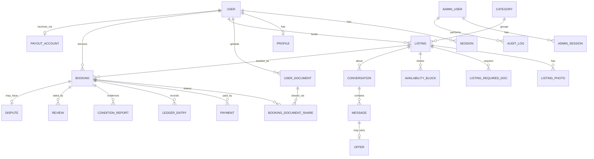
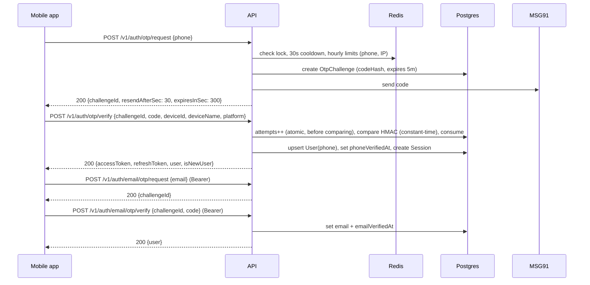
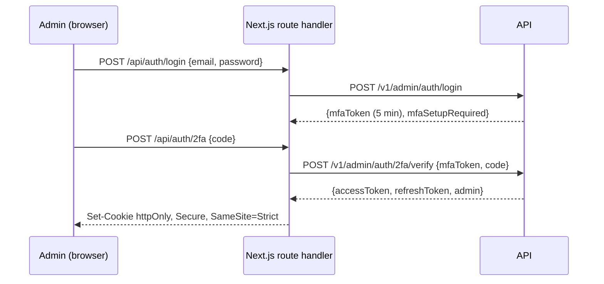
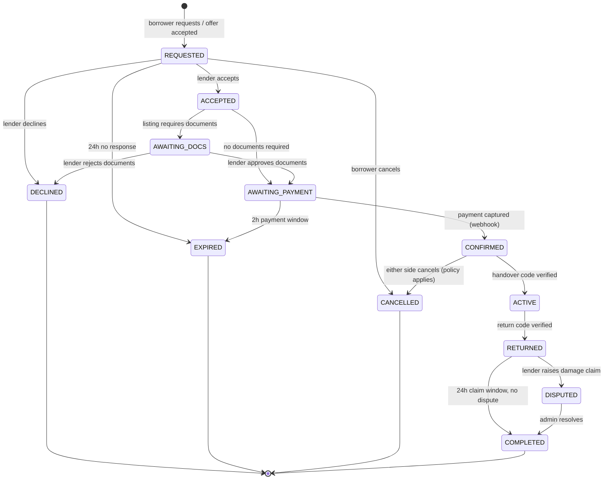
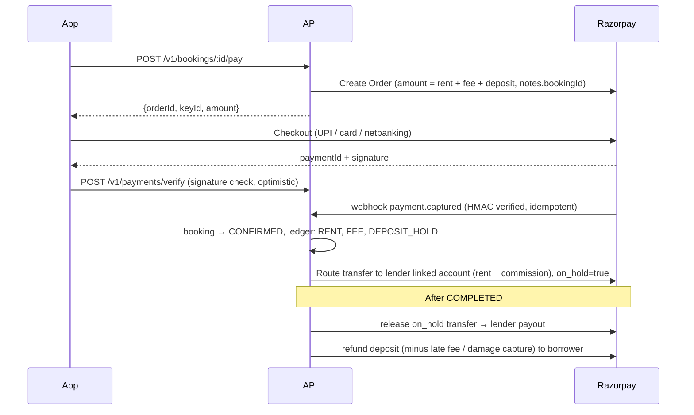
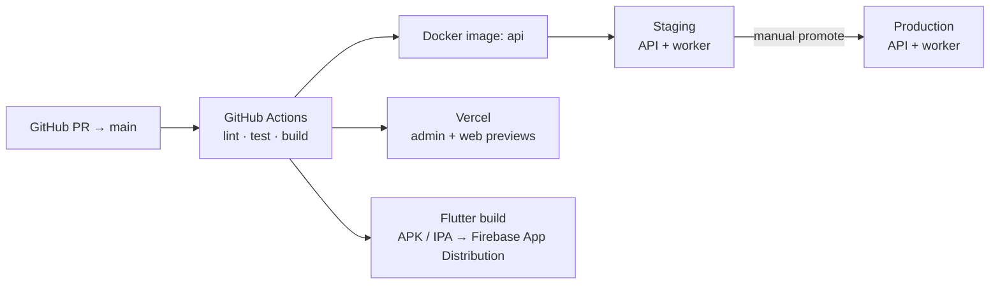

# Sajha — Architecture

System design for Sajha. For **what** we build, see the [PRD](./PRD.md). For the stack and conventions, see the [PLAN](./PLAN.md). For the build order, see [PHASES](./PHASES.md).

---

## 1. System context


- **One API** (a NestJS modular monolith) serves the mobile app, admin and web. Workers run as the same codebase in a separate process (`main.worker.ts`), so they scale independently.
- The **mobile app uploads files straight to S3** using presigned URLs; the API never proxies large files.
- **Admin** never exposes tokens to browser JavaScript. The Next.js server keeps the admin session in `httpOnly` cookies and calls the API server-to-server (Server Components and Server Functions).

## 2. Backend module map (`apps/api/src`)

```
src/
├── main.ts                 # HTTP + WebSocket bootstrap
├── main.worker.ts          # BullMQ workers bootstrap
├── config/                 # typed, validated env config
├── common/                 # guards, decorators, filters, interceptors, pipes, utils
├── prisma/                 # PrismaService + raw SQL helpers
├── providers/              # sms/, email/, storage/, payment/, push/ (interface + impls + fakes)
└── modules/
    ├── auth/               # user auth: phone OTP, email OTP, tokens, sessions     (Phase 1a)
    ├── otp/                # OTP challenge create/verify, rate limits               (Phase 1a)
    ├── admin-auth/         # admin login, TOTP 2FA, admin sessions, RBAC            (Phase 1a)
    ├── users/              # user record, /me, profile (city, bio, avatar)         (Phase 1a, 2a)
    ├── waitlist/           # marketing waitlist                                    (Phase 1d)
    ├── media/              # presigned uploads, sharp re-encode pipeline            (Phase 2a)
    ├── documents/          # personal document vault + admin review                 (Phase 2a)
    ├── categories/         # admin-managed categories, public list                  (Phase 3a)
    ├── listings/           # CRUD, photos, blocked dates, required docs, moderation (Phase 3a)
    ├── search/             # text + geo + date search, home feed, wishlist, views   (Phase 4a)
    ├── chat/               # conversations, messages, offers, masking, /ws gateway (Phase 5a)
    ├── realtime/           # RealtimeService (emit, presence), Redis Socket.IO adapter (Phase 5a)
    ├── notifications/      # device tokens, push when away, in-app notifications    (Phase 5a, 6a)
    ├── safety/             # blocks, reports, admin reports + audited transcripts  (Phase 5a)
    ├── bookings/           # state machine, requests, document sharing, timers (BullMQ) (Phase 6a)
    ├── payments/           # Razorpay orders, webhooks, refunds, ledger             (Phase 7)
    ├── payouts/            # Razorpay Route linked accounts, transfers              (Phase 7)
    ├── handover/           # handover/return codes, condition reports               (Phase 8)
    ├── reviews/            #                                                        (Phase 8)
    ├── disputes/           #                                                        (Phase 8)
    ├── admin/              # admin-facing endpoints per area (/v1/admin/*)          (each phase)
    └── audit/              # audit log writer                                       (Phase 1a)
```

**Cross-cutting pieces**
- `JwtAuthGuard` (users; the token check itself is `AccessTokenService`, shared with the chat socket), `AdminJwtGuard` + `@Roles()` (admins), `VerifiedGuard` + `@RequireVerified()` / `assertVerified()` (requires verified phone and email → 403 `VERIFICATION_REQUIRED` with `details.missing`; applied to listing create/publish in Phase 3, starting a chat in Phase 5, bookings from Phase 6)
- `RateLimiter` (Redis fixed window, `src/redis/rate-limiter.ts`) for per-user limits; dedicated OTP limiter
- Global `ValidationPipe` (whitelist, forbid unknown fields, transform)
- Global exception filter → `{ error: { code, message, details } }`
- `nestjs-pino` logging with a request ID; sensitive fields (OTP, tokens, phone) redacted
- `@nestjs/swagger` at `/docs` (disabled in production or behind basic auth)

## 3. Data model

### 3.1 Entity relationship overview



### 3.2 Phase 1 tables (built in Phase 1a)

The source of truth is [`apps/api/prisma/schema.prisma`](../apps/api/prisma/schema.prisma). IDs are UUID v7 (time-sortable), and columns are snake_case in Postgres.

| Table | Purpose | Key fields |
|---|---|---|
| `users` | App users (borrowers and lenders) | `phone` (E.164, unique), `phone_verified_at`, `email` (citext, unique), `email_verified_at`, `name`, `status` (ACTIVE/SUSPENDED/BANNED/DELETED), `deleted_at` |
| `admin_users` | Sajha staff | `email` (citext, unique), `password_hash` (argon2id), `role` (SUPER_ADMIN/OPS/SUPPORT), `status` (ACTIVE/DISABLED), `must_change_password`, `failed_login_count`, `locked_until`, `totp_secret_enc` (AES-256-GCM), `totp_enabled_at`, `totp_last_time_step` (replay guard) |
| `admin_recovery_codes` | One-time 2FA recovery codes | `code_hash` (SHA-256), `used_at` |
| `sessions` | **One login on one device, for either realm** | `realm` (USER/ADMIN), `user_id` *or* `admin_user_id` (CHECK constraint: exactly one, matching the realm), `device_id`, `device_name`, `platform`, `ip`, `user_agent`, `expires_at`, `revoked_at`, `revoke_reason`, `last_used_at` |
| `refresh_tokens` | Rotating refresh tokens inside a session | `session_id`, `token_hash` (SHA-256, unique), `expires_at`, `used_at` |
| `otp_challenges` | SMS and email one-time codes | `channel` (SMS/EMAIL), `purpose` (LOGIN/VERIFY_EMAIL), `target`, `user_id`, `code_hash` (HMAC-SHA256 with `OTP_PEPPER`), `attempts`, `max_attempts`, `expires_at`, `consumed_at` |
| `audit_logs` | Append-only security trail | `actor_type` (ADMIN/USER/SYSTEM), `actor_id`, `action` (e.g. `admin.login`, `admin.admins.create`, `user.account.delete`), `target_type`, `target_id`, `metadata`, `ip` |
| `waitlist_entries` | Marketing waitlist (Phase 1d) | `email` (unique), `city`, `role`, `source` |
| `profiles` | 1:1 with `users`, created on first edit (Phase 2a) | `user_id` (PK), `city`, `bio`, `avatar_key` (public bucket) |
| `user_documents` | Document vault (Phase 2a) | `type` (AADHAAR_MASKED, PAN, DRIVING_LICENCE, PASSPORT, VOTER_ID, COLLEGE_ID, EMPLOYEE_ID, ADDRESS_PROOF, OTHER), `label` (CHECK: required for OTHER), `front_key`, `back_key` (private bucket), `status` (PENDING/APPROVED/REJECTED), `rejection_reason`, `reviewed_by_id`, `reviewed_at`, `expires_on`, `deleted_at`. Partial unique index: one PENDING or APPROVED document per type per user |

**Verified-ID badge:** `idVerified` isn't stored. It's derived per request with a filtered count: at least one APPROVED, non-deleted document whose `expires_on` is empty or not yet past.

**Why sessions and refresh tokens are separate tables:** the session ID (`sid` in the access token) stays the same for the whole login, so guards can check on every request that the session is still live. Revoking a session signs that device out immediately, and rotating refresh tokens never invalidates in-flight access tokens.

### 3.3 Phase 3 tables (built in Phase 3a)

| Table | Purpose | Key fields |
|---|---|---|
| `categories` | Admin-managed, flat | `name`, `slug` (unique), `icon` (Material Symbols name), `sort_order`, `is_active`. Nine launch categories seeded by the migration |
| `listings` | An item for rent | `lender_id`, `category_id`, `title`, `description`, `condition` (NEW/LIKE_NEW/GOOD/FAIR), `brand`, `size`, `price_per_day_paise`, `weekly_discount_pct`, `deposit_paise`, `min_days`, `max_days`, `advance_notice_days`, `lat`/`lng` (exact pin, private), `location geography` (**kept in sync from lat/lng by a trigger**; GIST index for Phase 4), `area_label` (public), `exact_address_enc` (AES-256-GCM, `ADDRESS_ENC_KEY`), `status` (DRAFT/PENDING/LIVE/PAUSED/REJECTED/REMOVED/DELETED), `rejection_reason`, `reviewed_by_id`, `approved_at`, `published_at`. CHECK constraints mirror the limits in `listing-rules.ts` |
| `listing_photos` | Public bucket `listings/{id}/…` | `key` (≤1600 px WebP), `thumb_key` (≤480 px WebP), `width`, `height`, `sort_order` (0 = cover) |
| `listing_required_docs` | What a borrower must share (Phase 6) | `doc_type` (GOVERNMENT_ID/COLLEGE_OR_EMPLOYEE_ID/ADDRESS_PROOF/OTHER), `note` (CHECK: required for OTHER); unique per listing and type |
| `availability_blocks` | Dates the item can't be rented | `starts_on`, `ends_on` (dates, inclusive), `reason` (OWNER_BLOCK; BOOKING comes in Phase 6) |

**Listing lifecycle:** DRAFT → publish → **PENDING** (the lender has no approved listing yet) or **LIVE** (already trusted). An admin approves (sets `approved_at`, so the lender is trusted from then on) or rejects with a reason. A rejected listing goes back to DRAFT when the lender edits it. LIVE ⇄ PAUSED by the lender. An admin can unpublish PENDING, LIVE or PAUSED listings (→ REMOVED, with a reason). DELETED is a soft delete that also removes the photos. Every status change is a status-guarded `updateMany`, so two admins can't both act on the same listing.

**Privacy:** the public `GET /v1/listings/:id` returns `approxLat`/`approxLng` rounded to 2 decimals (~1 km) and `area_label`, never the pin or the address. Listings of a suspended or banned lender aren't public.

### 3.4 Phase 4 tables and search (built in Phase 4a)

| Table / column | Purpose | Key fields |
|---|---|---|
| `listings.search_vector` | Full-text search | `tsvector`, GIN index. Set by the `listings_sync_derived` trigger (which also keeps `location` in sync): title (A), brand + category name (B), description (C), `english` configuration. Renaming a category re-indexes its listings (`categories_refresh_listing_search` trigger) |
| `favorites` | Wishlist | PK `(user_id, listing_id)`, `created_at` |
| `listing_views` | "Popular this week" | PK `(listing_id, viewer_key, day)`: one row per viewer per day. `viewer_key` is the user id, or for guests an HMAC of IP + user agent + day, so no raw IP is stored. Pruning after 30 days arrives with the Phase 5 jobs |

**Search** (`src/modules/search`): one parameterised SQL query built from `Prisma.sql` fragments, never concatenated strings.
- Scope: LIVE listings of ACTIVE lenders.
- Keywords: `search_vector @@ websearch_to_tsquery('english', q)`.
- Radius: `ST_DWithin(location, point, r)` on the GIST index.
- Dates: no overlapping `availability_blocks`, days within `min_days`–`max_days`, and `start ≥ today + advance_notice_days`.
- Verified lenders: an approved, unexpired document, the same rule as the ID badge.
- Paging uses a keyset cursor over `(sort value, id)`, so infinite scroll never repeats or skips.
- Cards are then loaded by id with Prisma.
- Distances are rounded to 0.5 km (under 1 km → 0.5, shown as "< 1 km") so the exact pin can't be triangulated.

**Pricing** (`src/modules/listings/pricing.ts`, pure): rental days are inclusive; rent = price × days, less the weekly discount from 7 days on; the borrower fee is ₹0 for now; the total adds the refundable deposit. `GET /v1/listings/:id/quote` uses it, and so will bookings in Phase 6.

**Optional sign-in** (`OptionalJwtGuard`): public routes accept an optional Bearer token to personalise (saved flags; views keyed by user). With no header the caller is a guest. An invalid header is 401, so the app refreshes rather than silently browsing signed out.

### 3.5 Later tables (summary)

| Table | Key fields |
|---|---|
| `profiles` (additions) | location `geography(Point)` (Phase 3), ratingAvg, ratingCount (Phase 8) |
| `conversations` | listingId, borrowerId, lenderId, lastMessageAt; unique(listingId, borrowerId) |
| `messages` | conversationId, senderId, type (TEXT/IMAGE/OFFER/SYSTEM), body, maskedBody, imageKey, readAt |
| `offers` | messageId, startDate, endDate, pricePerDayPaise, status (PENDING/ACCEPTED/COUNTERED/DECLINED/EXPIRED), parentOfferId |
| `bookings` (6a) | listingId, borrowerId, lenderId, conversationId, offerId (unique, when made from an offer), source (REQUEST/OFFER), `startsOn`/`endsOn` (dates, inclusive), days, pricePerDayPaise, rentPaise, feePaise, depositPaise, totalPaise, status, expiresAt (deadline of the current step), declineReason, cancelledBy (BORROWER/LENDER/ADMIN), cancelledById, cancelReason, closedAt; handover code hashes come in Phase 8 |
| `booking_events` (6a) | bookingId, type (REQUESTED/ACCEPTED/DECLINED/EXPIRED/CANCELLED/DOCS_SUBMITTED/DOCS_APPROVED/DOCS_REJECTED), fromStatus, toStatus, actorType (USER/ADMIN/SYSTEM), actorId, note, createdAt; append-only |
| `booking_document_shares` (6a) | bookingId, requiredDocId, userDocumentId (set null if the vault copy is deleted), docType, label, verified (Sajha had approved it), frontKey/backKey (the booking's own copies), status (SUBMITTED/APPROVED/REJECTED), accessExpiresAt, purgedAt |
| `document_access_logs` (6a) | shareId, viewerId, viewerType, ip, createdAt |
| `payments` (7a) | bookingId, provider (razorpay/fake), orderId (unique), paymentId (unique), amountPaise, currency, method, status (CREATED/CAPTURED/FAILED/PARTIALLY_REFUNDED/REFUNDED), failureReason, capturedAt |
| `refunds` (7a) | paymentId, bookingId, providerRefundId (unique), amountPaise, breakdown (rent/fee/deposit), kind (CANCELLATION/LATE_PAYMENT/MANUAL), status (PENDING/PROCESSED/FAILED), attempts, adminId |
| `payout_accounts` (7a) | userId (unique), providerAccountId (Route linked account), status (PENDING/NEEDS_CLARIFICATION/ACTIVATED/REJECTED), beneficiaryName, bankLast4, ifsc, panLast4, email; full numbers go to Razorpay only |
| `transfers` (7a) | bookingId, lenderId, paymentId, providerTransferId, amountPaise, onHold, status (AWAITING_ACCOUNT/ON_HOLD/RELEASED/REVERSED/FAILED), attempts |
| `ledger_entries` (7a) | txnId, bookingId, type (PAYMENT_CAPTURED/REFUND/REFUND_GOODWILL/TRANSFER/TRANSFER_REVERSAL), account (GATEWAY/DEPOSIT_HELD/LENDER_PAYABLE/PLATFORM_REVENUE/GOODWILL), debitPaise, creditPaise, externalRef; append-only, each txn balanced (deferred trigger) |
| `webhook_events` (7a) | provider, eventId (unique per provider), type, receivedAt, processedAt |
| `bookings` (8a additions) | handedOverAt, returnedAt, completedAt, noShowAt, lateDays, lateFeePaise, keptPaise (deposit the lender keeps: late fee + dispute award); events HANDED_OVER/RETURNED/NO_SHOW/DISPUTED/COMPLETED/DISPUTE_RESOLVED. Handover and return codes are derived (HMAC with `OTP_PEPPER`), not stored |
| `condition_reports` (8a) | bookingId, stage (HANDOVER/RETURN), byUserId, photoKeys[] (1–6 private WebP, thumbs beside them), note; unique(bookingId, stage, byUserId) |
| `reviews` (8a) | bookingId, authorId, subjectId, authorRole, rating (1–5), comment, publishedAt (null while hidden); unique(bookingId, authorId) |
| `disputes` (8a) | bookingId (unique), openedById, reason (DAMAGE/MISSING_PARTS/NOT_RETURNED/OTHER), description, claimPaise, evidenceKeys[], responseNote, responseKeys[], respondedAt, status (OPEN/RESOLVED), keptPaise, resolutionNote, resolvedById, resolvedAt |
| `listings` (8a additions) | ratingAvg, ratingCount (borrowers' published reviews) |
| `transfers` (8a addition) | fromDeposit (deposit kept after the rental; one per booking) |
| `reports` | reporterId, targetType, targetId, reason, status |
| `notifications` (6a) | userId, type (e.g. `booking.requested`), title, body, data (`{bookingId}`), readAt, createdAt |
| `device_tokens` | userId, sessionId, fcmToken, platform |

**Double-booking guard** (raw SQL in a migration; bookings, like availability blocks, are whole days):

```sql
CREATE EXTENSION IF NOT EXISTS btree_gist;
ALTER TABLE bookings ADD CONSTRAINT bookings_no_overlap
  EXCLUDE USING gist (listing_id WITH =, daterange(starts_on, ends_on, '[]') WITH &&)
  WHERE (status IN ('AWAITING_PAYMENT','CONFIRMED','ACTIVE','RETURNED','DISPUTED'));
```

A partial unique index (`bookings_one_open`) also allows only one booking in progress per borrower and listing.

## 4. Authentication & authorization

### 4.1 App users — phone OTP + email OTP



**OTP rules**
- 6 random digits (`crypto.randomInt`), stored as `HMAC-SHA256(target:code, OTP_PEPPER)`, **never logged** (the log redacts `code`, `password`, `refreshToken`, `phone` and auth headers)
- Valid for **5 minutes**, with **5 verify attempts** per challenge; a new request invalidates earlier open challenges for the same target and purpose
- Resend **cooldown of 30 seconds**
- Limits (Redis counters, 1-hour windows): **5 requests per phone per hour**, **20 per IP per hour**, **10 verify failures per phone per hour**, after which the phone is locked for 1 hour
- Phone numbers are normalised to E.164 with `libphonenumber-js` (India `+91` only at launch)
- The email must be unique; if it belongs to another user, the API returns `EMAIL_IN_USE`
- Locally, `SMS_PROVIDER=console` prints the code to the API log, and emails go to Mailpit. `OTP_DEV_BYPASS_CODE` (for example, `000000`) can be set for development only. Both are refused at boot in staging and production.

**Tokens**
| Token | Format | Lifetime | Storage (mobile) |
|---|---|---|---|
| Access | JWT (HS256 → RS256 later), claims `sub`, `sid`, `typ:"user"` | 15 minutes | Memory |
| Refresh | 256-bit random opaque string, DB stores SHA-256 hash | 30 days (sliding) | `flutter_secure_storage` |

- **Rotation:** every `/refresh` call marks the presented token used (`used_at`) and issues a new one in the same session. The two steps run in one transaction guarded by `used_at IS NULL`, so if two refreshes race with the same token, only one wins.
- **Reuse detection:** presenting a refresh token that was **already used** means it was copied, so the **whole session is revoked** (`REFRESH_REUSED`) and that device must sign in again.
- **Every authenticated request** checks the access token's session (`sid`) is still active and the user is `ACTIVE`, so logout, logout-all, "sign out that device" and suspension take effect immediately, not when the 15-minute token expires.
- **Logout** revokes the current session; **logout-all** revokes every session.
- A `SUSPENDED` or `BANNED` status blocks login, refresh and every authenticated call (`ACCOUNT_SUSPENDED`).
- **Account deletion** (`DELETE /v1/me`) anonymises the row (`phone` → `deleted:<id>`, email and name cleared), revokes all sessions and writes an audit entry. Signing in with the same number later creates a new account.

**User auth endpoints (Phase 1a)**
| Method & path | Auth | Body → Response |
|---|---|---|
| `POST /v1/auth/otp/request` | – | `{phone}` → `{challengeId, expiresInSec, resendAfterSec}` |
| `POST /v1/auth/otp/verify` | – | `{challengeId, code, deviceId, deviceName?, platform?}` → `{accessToken, refreshToken, expiresInSec, isNewUser, user}` |
| `POST /v1/auth/refresh` | – | `{refreshToken}` → `{accessToken, refreshToken, expiresInSec}` |
| `POST /v1/auth/logout` | Bearer | `{}` → `204` |
| `POST /v1/auth/logout-all` | Bearer | `{}` → `204` |
| `POST /v1/auth/email/otp/request` | Bearer | `{email}` → `{challengeId, expiresInSec, resendAfterSec}` |
| `POST /v1/auth/email/otp/verify` | Bearer | `{challengeId, code}` → `{user}` |
| `GET /v1/me` | Bearer | → `{user}` |
| `PATCH /v1/me` | Bearer | `{name}` → `{user}` |
| `GET /v1/me/sessions` | Bearer | → `[{id, deviceName, platform, lastUsedAt, current}]` |
| `DELETE /v1/me/sessions/:id` | Bearer | → `204` |
| `DELETE /v1/me` | Bearer | → `202` (account deletion request; soft delete + anonymise) |

**Error codes** (full list in `apps/api/src/common/errors/error-codes.ts`):

| Code | HTTP | When |
|---|---|---|
| `PHONE_INVALID` | 400 | Not a valid Indian mobile number |
| `OTP_COOLDOWN` | 429 | New code requested within 30s (`Retry-After` header set) |
| `OTP_RATE_LIMITED` | 429 | Hourly limit per phone/email or IP reached, or the number is locked |
| `OTP_INVALID` | 400 | Wrong code (`details.attemptsLeft`), or a challenge that isn't yours |
| `OTP_EXPIRED` | 400 | Expired, already used, or replaced by a newer code |
| `OTP_TOO_MANY_ATTEMPTS` | 429 | 5 wrong codes on this challenge |
| `OTP_DELIVERY_FAILED` | 503 | SMS/email provider failed (cooldown is released so the user can retry) |
| `EMAIL_IN_USE` | 409 | Email already belongs to another account |
| `TOKEN_INVALID` / `TOKEN_EXPIRED` | 401 | Bad, revoked or expired token |
| `REFRESH_REUSED` | 401 | Used refresh token presented again; session revoked |
| `ACCOUNT_SUSPENDED` | 403 | User suspended/banned, or admin disabled |
| `VALIDATION_FAILED` | 400 | Body failed validation (`details` maps field → messages) |
| `UPLOAD_NOT_FOUND` | 400 | Upload key unknown, expired, someone else's, for another purpose, or not uploaded yet |
| `UPLOAD_INVALID` | 400 | File isn't a real JPEG/PNG/WebP, can't be decoded, or its size differs from what was announced |
| `UPLOAD_RATE_LIMITED` | 429 | More than 30 uploads in an hour |
| `DOCUMENT_ALREADY_EXISTS` | 409 | A pending or approved document of this type already exists |
| `DOCUMENT_NOT_PENDING` | 409 | Approving or rejecting a document that's already been reviewed |
| `USER_STATUS_CONFLICT` | 409 | Suspend/ban/reactivate isn't valid from the user's current status |
| `VERIFICATION_REQUIRED` | 403 | Route needs a verified phone and email (`details.missing`): creating and publishing listings (bookings from Phase 6) |
| `LISTING_INCOMPLETE` | 400 | Publishing without a photo or location (`details.missing`) |
| `LISTING_STATUS_CONFLICT` | 409 | Action doesn't fit the listing's status (e.g. approving a listing that isn't pending, editing a removed one) |
| `LISTING_PHOTO_LIMIT` | 409 | More than 8 photos |
| `CATEGORY_SLUG_TAKEN` | 409 | Another category uses this slug |
| `CATEGORY_INACTIVE` | 400 | The category doesn't exist or is hidden |
| `FAVORITE_OWN_LISTING` | 400 | Saving your own listing to your wishlist |

### 4.2 Admins — email + password + TOTP 2FA



- Passwords are hashed with **argon2id**; minimum length 12. An unknown email is checked against a dummy hash, so the response takes the same time either way.
- **Lockout:** wrong passwords and wrong 2FA codes share one counter. 5 failures lock the account for 15 minutes (`ACCOUNT_LOCKED`, 429).
- **TOTP is mandatory.** First login forces setup (QR code + verify) and returns 8 one-time recovery codes (stored as SHA-256). The TOTP secret is encrypted with `TOTP_ENC_KEY`, and the last accepted time step is stored so a code can't be replayed.
- The password step returns only an `mfaToken` (5 minutes, `typ:"admin_mfa"`), never session tokens.
- Admin tokens use a separate secret (`JWT_ADMIN_ACCESS_SECRET`) and `typ:"admin"`, so user and admin tokens are not interchangeable. The access token lasts **10 minutes** and the session **12 hours** (refresh never extends it).
- **Invited admins** get a temporary password and `mustChangePassword`. Until they change it, every admin endpoint except `me`, `me/password` and `logout` returns `PASSWORD_CHANGE_REQUIRED`. Changing the password signs out their other sessions.
- Disabling an admin revokes all their sessions. A Super Admin can't change their own role or status (`CANNOT_MODIFY_SELF`).
- **RBAC:** `@Roles('SUPER_ADMIN')` etc. Permission matrix:

| Capability | SUPER_ADMIN | OPS | SUPPORT |
|---|:-:|:-:|:-:|
| Manage admin users | ✓ | – | – |
| Suspend / ban users | ✓ | ✓ | – |
| Review documents | ✓ | ✓ | – |
| Moderate listings | ✓ | ✓ | ✓ |
| View bookings | ✓ | ✓ | ✓ |
| Resolve disputes, refunds, payouts | ✓ | ✓ | – |
| View audit log | ✓ | – | – |

- The first Super Admin is created by a CLI seed script (`pnpm --filter @sajha/api seed:admin -- --email … --name …`). There is no public signup.
- Every admin login, logout, 2FA change and mutating action is written to `audit_logs`.

**Admin auth endpoints (Phase 1a)**
| Method & path | Body → Response |
|---|---|
| `POST /v1/admin/auth/login` | `{email, password}` → `{mfaToken, mfaSetupRequired}` |
| `POST /v1/admin/auth/2fa/setup` | `{mfaToken}` → `{otpauthUrl, qrDataUrl}` |
| `POST /v1/admin/auth/2fa/verify` | `{mfaToken, code \| recoveryCode}` → `{accessToken, refreshToken, expiresInSec, admin, recoveryCodes?}` |
| `POST /v1/admin/auth/refresh` | `{refreshToken}` → tokens |
| `POST /v1/admin/auth/logout` | → `204` |
| `GET /v1/admin/me` | → `{admin}` |
| `POST /v1/admin/me/password` | `{currentPassword, newPassword}` → `{admin}` |
| `GET /v1/admin/me/sessions` · `DELETE /v1/admin/me/sessions/:id` | List own sessions / sign one out |
| `GET/POST/PATCH /v1/admin/admins` | Super Admin: list, invite (temporary password), change role, disable |
| `GET /v1/admin/users` | List and search app users (read-only in Phase 1) |

## 5. Booking lifecycle



- Transitions live in **one `BookingStateMachine` service** (`modules/bookings/booking-state-machine.ts`). Each transition runs inside a DB transaction with `SELECT … FOR UPDATE`, checks the pure rules in `booking-rules.ts`, updates the booking and writes a `booking_events` row. After the commit it schedules the next timer, posts a SYSTEM note in the booking's chat, emits `booking:updated` to both people and sends notifications. Failures after the commit are logged, never thrown.
- **Payment (Phase 7a):** `confirmPayment` (SYSTEM) moves AWAITING_PAYMENT → CONFIRMED when the payment is captured, which writes a `PAID` event. The borrower and lender can cancel a CONFIRMED booking until handover, with refunds by the policy (§6).
- **The rental (Phase 8a, `modules/rentals/`):**
  - **Codes:** each is 6 digits, derived as HMAC(`OTP_PEPPER`, booking|stage), so nothing is stored.
    - Only the person who shows a code can read it (`GET /bookings/:id/code`): the borrower's at handover, the lender's at return.
    - The QR holds `sajha://booking/<id>/<stage>/<code>`.
    - 5 wrong tries in 15 minutes lock the code.
  - **Handover** (`handOver`, lender): CONFIRMED → ACTIVE with the code and 2–6 condition photos. It's allowed from the day before the start date until the end date.
  - **Return** (`markReturned`, borrower): ACTIVE → RETURNED.
    - The item is due by midnight IST after the end date. The late fee is 1× the daily rate per started late day, and never more than the deposit.
    - The fee is saved at return as `keptPaise`.
  - **Condition photos:** either side can add up to 6 per stage, while the item is out (handover) or in the claim window (return).
  - **No-show** (`noShow`, lender, from the first day): CONFIRMED → CANCELLED as a late borrower cancellation (`cancelledBy = BORROWER`, `noShowAt`). The deposit comes back and the lender is paid their rent share.
  - **Claim window:** 24 h. The returned booking's deadline is `returnedAt + 24h`, and when it passes the expiry job runs `complete` (RETURNED → COMPLETED); the sweep catches misses.
  - **Disputes** (`openDispute`, lender):
    - Opened from RETURNED within the window, or from ACTIVE once the item is 2 days overdue (NOT_RETURNED).
    - The claim is at most the deposit less the late fee. The borrower replies once.
    - An admin decides with `resolveDispute` (DISPUTED → COMPLETED) and a kept amount; it's audited.
  - **Admin cancel** is refused once the item has changed hands (ACTIVE, RETURNED, DISPUTED).
  - **Reviews** (1–5 and an optional comment) are allowed within 14 days of completion.
    - Double-blind: a review is published when both have written one, or 7 days after completion (an hourly `rentals` job).
    - Publishing updates `profiles.ratingAvg/ratingCount` and, for borrowers' reviews, the listing's.
  - **Reminders** (hourly `rentals` job): pickup tomorrow, return tomorrow, due today, and overdue (daily, also by SMS: `SmsProvider.sendOverdue`). Each is deduplicated per type, booking and IST day against `notifications`.
- **As built in Phase 6:**
  - "Accepted" is an event, not a status: accepting moves straight to `AWAITING_DOCS` or `AWAITING_PAYMENT`.
  - An offer accepted in chat creates the booking already accepted, inside the offer's transaction.
  - Cancelling before payment is allowed for the borrower (any step), the lender (after accepting; it counts against them) and admins. The PRD refund tiers are `refundFor()`, applied from Phase 7.
  - The detail DTO carries `can: {accept, decline, cancel, shareDocs, reviewDocs}` from the same rules, so the apps don't repeat them.
- **Timers** are **BullMQ delayed jobs** on the `bookings` queue, and each job re-checks the state before acting (idempotent):
  - Deadlines: lender reply 24 h, sharing documents 24 h, reviewing them 24 h, payment hold 2 h. Each is configurable (`BOOKING_*_TTL_MIN`), and none runs past the end of the first rental day.
  - A `sweep-expired` job runs every 5 minutes and catches lost jobs.
  - The worker runs inside the API process unless `JOBS_WORKER=false`.
- The date range is held by the exclusion constraint from `AWAITING_PAYMENT` onward. Another borrower can't pay for overlapping dates; accepting or approving into a held range fails with `BOOKING_DATES_TAKEN`.
- **Availability** is the lender's `availability_blocks` plus held bookings (`bookings/availability.ts`). Bookings aren't written into `availability_blocks`, because the lender's editor replaces that table wholesale. Held dates are used by search (`NOT EXISTS` on held bookings), the quote endpoint, the public listing's `blocks`, chat offers and new requests.

## 6. Payments & payouts (Razorpay)



- The **webhook is the source of truth**; the client verify call (HMAC of `order_id|payment_id` with the key secret) only gives a faster UI. Both call `PaymentsService.capture`, which locks the payment row, so whichever comes first confirms and the other is a no-op.
- Webhooks are checked with HMAC-SHA256 over the **raw body** (the app is created with `rawBody: true`). Each event is stored in `webhook_events` (by `x-razorpay-event-id`) before it's applied, so a retried event is skipped.
- **Providers:** `PaymentProvider` (`providers/payments/`) is either `RazorpayProvider` (REST with basic auth: orders, refunds, v2 accounts and stakeholders and products for Route, payment transfers with `on_hold`, reversals, release) or `FakePaymentProvider`.
  - The fake is for development, tests and CI. It uses the same signatures, instant refunds and auto-activated accounts, and can fail on demand in tests.
  - `POST /v1/dev/payments/:orderId/checkout` (fake only, never in staging or production) plays checkout and sends the signed webhook.
- **Ledger** (`payments/ledger.ts`, double entry; C is 10% of rent):

  | When | Debit | Credit |
  |---|---|---|
  | Payment captured | GATEWAY (rent + fee + deposit) | DEPOSIT_HELD deposit · LENDER_PAYABLE rent − C · PLATFORM_REVENUE C + fee |
  | Refund | DEPOSIT_HELD · LENDER_PAYABLE · PLATFORM_REVENUE (the commission follows the rent refunded) | GATEWAY |
  | Goodwill refund (admin) | GOODWILL | GATEWAY |
  | Transfer to the lender | LENDER_PAYABLE | GATEWAY |
  | Transfer reversed | GATEWAY | LENDER_PAYABLE |
  | Deposit kept after the rental (8a) | DEPOSIT_HELD | LENDER_PAYABLE (then a transfer) |

  Postings are written when the provider accepts the refund or transfer, never before. A deferred trigger rejects any unbalanced transaction, and another makes the table append-only. `GET /v1/admin/ledger/summary` reports balances and reconciliation checks.
- **Cancelling after payment:** `BookingStateMachine.onTransition` lets payments react.
  - A CANCELLED booking that was CONFIRMED is refunded by `refundFor()` (the borrower's tier; the lender or admin gives everything back).
  - The held transfer is reversed, and the lender's share of any rent kept is sent at once (`onHold: false`).
  - A payment that arrives after the booking stopped waiting is refunded in full (LATE_PAYMENT).
- **Route payouts:** lenders set up a linked account (`PUT /v1/me/payout-account`). Transfers wait in AWAITING_ACCOUNT until `account.activated`.
- **Settlement at COMPLETED (Phase 8a, `PaymentsService.settle`),** after the claim window or a dispute decision:
  1. Post the deposit the lender keeps (`DEPOSIT_KEPT`).
  2. Release the held rent transfer (`releaseTransfer`; one not sent yet goes out unheld).
  3. Transfer the kept deposit (`fromDeposit`, unheld).
  4. Refund the rest of the deposit (`DEPOSIT_RETURN`).

  Each step is idempotent, and the `payments` sweep re-runs settlement for completed bookings with rent still held or no deposit refund.
- **Failures:** a failed provider call is saved with the reason and retried by the `payments` sweep (every 5 minutes, up to 5 attempts; refunds only when Razorpay never accepted them). The sweep also refunds cancelled paid bookings that were missed.

## 7. Chat & realtime (Phase 5a)

- **Tables** (migration `20260924140000_chat`):
  - `conversations`: unique (listing, borrower); `lastMessageAt` and a masked `lastMessagePreview`.
  - `messages`: TEXT / IMAGE / OFFER / SYSTEM, with `body` (as typed), `maskedBody` and `masked`. `clientId` is unique per sender and conversation, and `readAt` holds the read receipt.
  - `offers`: partial unique indexes allow one PENDING and one ACCEPTED offer per conversation.
  - `user_blocks`, `reports` (one OPEN report per reporter and target), and `device_tokens` (each tied to a session).
- **Writes go through REST:** `POST /v1/conversations/:id/messages` is stored first and is idempotent on `clientId`. Only then is it broadcast.
- **Socket.IO namespace `/ws`:**
  - It authenticates at the handshake with `auth: { token }`, using `AccessTokenService`, which it shares with `JwtAuthGuard`. A refused handshake fails with the error code as its message (`TOKEN_EXPIRED` → the app refreshes and reconnects). The server disconnects the socket when the access token expires.
  - Each socket joins `user:{id}`.
  - Server → client events: `message:new` (each participant gets their own view: the sender's text, or the masked text), `message:read`, `offer:updated`, `typing`.
  - The client → server event is `typing {conversationId}` (participants only, throttled to one per 2 s).
  - The **Redis adapter** (`RedisIoAdapter`, set in `configureApp`) lets any instance emit to any socket. `RealtimeService.isOnline()` checks presence across instances.
- **Push:** when the recipient has no socket open, `NotificationsService.notifyIfAway` sends the masked preview to their devices through `PushProvider` (`console` or `fcm`, FCM HTTP v1 with a service account). Tokens of signed-out or expired sessions, and tokens FCM reports as unregistered, are deleted. Push never fails the request that caused it.
- **Contact masking** (`chat/masking.ts`, pure and unit-tested):
  - It hides phone numbers (matched on digit *groups*, so dates and prices aren't caught), emails (including "at … dot"), UPI IDs and WhatsApp/Telegram links. Everything is replaced with `•••`.
  - It applies until a booking is `CONFIRMED` (Phase 7).
  - The other participant only ever receives `maskedBody`. Admins see `body` in the audited transcript.
- **Offers** (`chat/offers.service.ts`, `offer-rules.ts`):
  - Either side proposes dates and a price per day; rent = price × days.
  - A new offer or a counter marks the open one COUNTERED.
  - Only the other side can accept or decline. Accepting re-runs `pricing.quote()` against the listing's rules and needs the listing to be LIVE, and any earlier accepted deal becomes SUPERSEDED.
  - A pending offer expires after 48 h or at the end of its first day. The status is computed on read; the row is updated when someone acts on it.
- **Limits:** 30 messages or offers a minute, 20 new chats a day, 10 reports a day. They use `RateLimiter` (`src/redis/rate-limiter.ts`) → 429 `RATE_LIMITED` with `Retry-After`.
- **Blocks** (either direction) → 403 `USER_BLOCKED` on send, offer, answer and new chats. The chat stays readable.
- Phase 6 adds `booking:updated` and an in-app notification centre.

## 8. Files & the document vault

| Bucket | Contents | Access |
|---|---|---|
| `sajha-public-media` | Listing photos, avatars (resized variants) | Public via CDN, with random UUID keys |
| `sajha-private-docs` | ID and other documents, condition photos, dispute evidence, `tmp/` uploads | Private; SSE-KMS encryption (`S3_PRIVATE_SSE`); **no public access** |

Locally and in e2e tests, storage is SeaweedFS's S3 API (`infra/docker-compose.yml`, Testcontainers).

**Upload flow (Phase 2a):**
1. `POST /v1/uploads {purpose: AVATAR|DOCUMENT, contentType, sizeBytes}`. The API allows JPEG/PNG/WebP only (avatar ≤ 5 MB, document ≤ 10 MB) and 30 uploads per hour. It returns `{key, url, headers, expiresInSec: 300}`: a presigned PUT whose signature covers `Content-Type` and `Content-Length`, to `tmp/{purpose}/{userId}/{uuid}` in the **private** bucket. A Redis ticket (`upload:{key}`, 15 minutes) binds the key to the user, purpose and size.
2. The client PUTs the bytes straight to storage, with no Bearer header.
3. The client hands the key to the owning resource (`PUT /v1/me/avatar`, `POST /v1/me/documents`). The API **finalises**:
   - checks the ticket (same user and purpose) and the object's size
   - sniffs the magic bytes, never trusting the Content-Type header
   - re-encodes with sharp: avatar → 512×512 WebP (public bucket); document → JPEG, longest side ≤ 2400 px (private bucket, SSE). Re-encoding strips EXIF (including GPS) and neutralises polyglot files; a 40-megapixel input limit guards against decompression bombs.
   - deletes the temp object and the ticket.

**Chat photos (Phase 5a):** purpose `CHAT_IMAGE` (≤ 10 MB), finalised by `POST /v1/conversations/:id/messages {type: IMAGE, key}` into a ≤1600 px WebP and a ≤480 px thumbnail in the **private** bucket under `chat/{conversationId}/`. Participants get 10-minute presigned links in each message; admins get them in the audited transcript.

**Listing photos (Phase 3a):** the same flow with purpose `LISTING_PHOTO` (≤ 10 MB). `POST /v1/me/listings/:id/photos {key}` finalises it: magic-byte check, then sharp produces a ≤1600 px WebP and a ≤480 px thumbnail WebP (EXIF stripped) in the public bucket under `listings/{listingId}/`. Deleting a photo or listing removes the objects. Resizing runs in the request for now; it moves to a BullMQ job in Phase 5.

**Viewing your own document / admin review:** `GET /v1/me/documents/:id/view?side=` and `GET /v1/admin/documents/:id/view?side=` return a 5-minute presigned GET (`no-store`, inline) and write `document.view` / `admin.document.view` to `audit_logs`. Document list responses never contain storage keys or URLs.

**Sharing documents for a booking (Phase 6a):** `POST /v1/bookings/:id/documents {shares: [{requiredDocId, userDocumentId}]}`.
- The borrower picks one vault document per document the listing asks for. It must match the type, be live (not rejected, expired or deleted), and belong to them.
- The files are **copied** to `bookings/{bookingId}/` in the private bucket, so deleting from the vault doesn't affect the booking and purging is clean.
- The share records whether Sajha had verified the document, and writes `user.booking.documents.share` to the audit log.

**Viewing a shared document:** a lender calls `GET /v1/bookings/:id/documents/:shareId/view?side=`.
- The API checks that the viewer is the booking's lender, that the booking state is between `AWAITING_DOCS` and `RETURNED`, and that `accessExpiresAt` hasn't passed (otherwise 410 `DOCUMENT_ACCESS_ENDED`).
- It then writes a `document_access_logs` row and a `booking.document.view` audit entry, and returns a **5-minute presigned GET URL** plus the watermark text ("Shared with Asha Patil for booking #4F2A9C · 24 Sept, 9:10 pm").
- The borrower sees each view (who and when) on the booking.
- The app shows the document in an in-app viewer with that watermark and screenshot blocking on Android (`FLAG_SECURE`) (Phase 6b).

**Purge job:** closing a booking ends access (`accessExpiresAt = closedAt`). A daily BullMQ job (`purge-shares`, 03:00 IST) deletes the copies `SHARE_RETENTION_DAYS` (30) after the booking closed, unless it's disputed.

## 9. Mobile app architecture (`apps/mobile`)

```
lib/
├── main.dart / app.dart          # ProviderScope, MaterialApp.router, theme
├── core/
│   ├── config/                   # env (dev/staging/prod via --dart-define)
│   ├── network/                  # dio client, AuthInterceptor, TokenManager (single-flight refresh), ApiException, UploadClient
│   ├── media/                    # PhotoPicker: image_picker + image_cropper (square crop for avatars)
│   ├── storage/                  # secure storage wrapper
│   ├── router/                   # go_router + auth redirect
│   ├── theme/                    # design tokens → ThemeData, typography
│   └── effects/                  # shaders/*.frag loaders, animated backgrounds, uiverse-style widgets
├── features/
│   ├── onboarding/
│   ├── auth/
│   │   ├── data/                 # AuthRepository, models (hand-written fromJson)
│   │   ├── application/          # AuthController (Riverpod AsyncNotifier), session state
│   │   └── presentation/         # PhoneScreen, OtpScreen, EmailScreen, ProfileSetupScreen
│   ├── profile/                  # ProfileRepository, ProfileScreen (photo, name, city, bio, badges)   (Phase 2b)
│   ├── documents/                # DocumentsRepository, My documents, add flow, viewer                  (Phase 2b)
│   ├── listings/                 # ListingsRepository, ListingEditor + 7-step wizard, My listings,     (Phase 3b)
│   │                             #   ListingDetailView (also the public item page)
│   ├── discovery/                # DiscoveryRepository, SearchArea, saved/recent state; search,       (Phase 4b)
│   │                             #   filters, item page with quote, wishlist, area picker
│   ├── chat/                     # ChatRepository, inbox + unread, ChatController, chat screen,       (Phase 5b)
│   │                             #   offer and report sheets; core/realtime (socket), core/push
│   ├── home/ settings/
│   ├── chat/ bookings/ ...       # later phases
└── shared/widgets/               # buttons, inputs, OTP field, loaders
shaders/                          # GLSL fragment shaders (declared in pubspec `shaders:`)
```

- **Auth state** is a Riverpod `Notifier<AuthState>` with a sealed state: `AuthUnknown` (checking the stored session, or offline with a retry), `Unauthenticated` (with an optional "why you were signed out" message) and `Authenticated` (which knows whether the name and email steps are still due). All redirect rules live in one pure function, `authRedirect()`, which is unit-tested; go_router re-runs it whenever the auth state changes.
- **Tokens:** the access token is kept in memory and the refresh token in `flutter_secure_storage`. `AuthInterceptor` adds the token and, on a 401, asks `TokenManager` to refresh. The refresh is single-flight, so concurrent 401s share one refresh call (the server rotates refresh tokens, so two parallel refreshes would sign the device out). The request is then retried once. If the server says the session is gone (revoked, expired or suspended), the app signs out with a message. If the refresh fails only because of the network, the session is kept.
- **Uploads** (Phase 2b): `UploadClient` sniffs the image type, calls `POST /v1/uploads`, then PUTs the bytes to the presigned URL with a **separate Dio that has no auth interceptor**: the signed URL is the credential, and the Bearer token must never reach storage. The key then goes to `PUT /v1/me/avatar` or `POST /v1/me/documents`. `PhotoPicker` sits behind a provider, so widget tests swap in a fake, and `FakeSajhaApi` plays both the API and a storage host.
- **Listing wizard** (Phase 3b): a `ListingEditor` notifier holds one `ListingDraft`, scoped per editor screen with a `ProviderScope` seeded from the listing being edited. Each step validates before moving on. Saving creates or updates the listing, then:
  - uploads new photos, removes deleted ones and applies the chosen order
  - replaces the blocked dates and required documents
  - publishes when it's a draft

  The draft remembers the listing id and the uploaded photos after each step, so a retry never creates a duplicate. The pickup map (`flutter_map`, tile URL from `MAP_TILE_URL`) only moves the pin on the lender's own gestures or "Use my location". Tests switch tiles off and fake the location.
- **Guest browsing** (Phase 4b): signed-out users who have seen onboarding may open the browse routes (`/home`, `/search`, `/area`, `/item/:id`); `authRedirect` sends everything else to sign-in.
  - Actions that need an account call `requireSignIn(returnTo)`. It stores where the guest was and replaces the stack with the login screen, rather than pushing it, so the router's redirects always see the sign-in pages.
  - Once signed in (after the name and email steps for new users), `authRedirect` sends the user to `returnTo`. For a save, that's `/item/:id?save=1`, and the page finishes the save.
  - When the auth state changes, go_router re-checks the bottom page of the stack, so the router checks the page on top instead. Otherwise a page pushed over home, such as settings, would stay open after sign-out.
- **Chat** (Phase 5b):
  - **Socket:** `RealtimeClient` (`core/realtime/`, Socket.IO over WebSocket) connects to `/ws` with the access token (`TokenManager.validAccessToken()`).
    - A refused handshake (`TOKEN_EXPIRED` / `TOKEN_INVALID`) or the server closing the socket at token expiry triggers one refresh, then a reconnect. Network drops back off 1 s → 30 s.
    - `realtimeConnectionProvider` keeps it open only while signed in and in the foreground (`AppLifecycleListener`). Resuming refreshes the inbox and unread badge.
  - **Writes:** the app only listens on the socket; writes go over REST. `ChatController` (one per open chat) shows a sent message at once with a `clientId`, then swaps in the stored message. A failed send can be retried, and the server stores it only once.
  - **Merging events:** `message:new`, `message:read`, `offer:updated` and `typing` are merged into the open chat. After offer actions it reloads the newest messages in case the socket missed the system note.
  - **Inbox and badge:** `inboxProvider` and `unreadCountProvider` refetch on `message:new` / `message:read`.
  - **Push:** `PushService` is a no-op unless the build has `FIREBASE_*` settings. Then `FirebasePushService` initialises Firebase from them (no google-services files), registers the token via `PUT /v1/me/devices/push-token` after sign-in and on rotation, and opens `/chat/:id` when a notification is tapped.
  - **Routes:** guests reach chat through `requireSignIn(returnTo: /item/:id?chat=1)`. `/inbox` and `/chat/:id` need an account.
- **Bookings** (Phase 6b, `features/bookings/`):
  - `BookingsRepository` covers `/v1/bookings` and `/v1/me/notifications`.
  - `bookingProvider(id)` is one booking page. It reloads on `booking:updated` for that id, and actions replace it with the API's answer. `bookingsProvider((role, scope))` is My bookings. `notificationsProvider` and `unreadNotificationsProvider` back the bell; `notification:new` refreshes them.
  - Screens show buttons from the detail's `can` flags, so the rules live only in the API.
  - "Request to book" follows the chat pattern for guests: `requireSignIn(returnTo: /item/:id?book=1&from=…&to=…)`. The item page reopens the request with those dates after sign-in.
  - **Shared-document viewer:** `ScreenProtection` (`core/security/`) sits over the `sajha/secure` method channel. On Android it sets `FLAG_SECURE` for as long as the viewer is open. On iOS it reports `UIScreen.isCaptured` changes, and the viewer blurs while the screen is being recorded or mirrored. A watermark with the lender's name, the booking reference and the time is drawn over the image. Tests use a fake.
  - A push tap with `bookingId` opens `/booking/:id`. Resuming the app refreshes the bell's badge.
- **Payments** (Phase 7b, `features/payments/`, `core/payments/`):
  - `PaymentsRepository` covers `/bookings/:id/pay`, `/payments/verify`, the dev test checkout, `/me/payout-account` and `/me/earnings`.
  - `PaymentGateway` is `RazorpayGateway` (`razorpay_flutter`), faked in tests. `payForBooking()` picks the test sheet when the API's provider is `fake`.
  - `PaymentProcessingScreen` verifies, then watches `bookingProvider(id)` until it's paid and confirmed. The webhook's `booking:updated` confirms it even if verify failed on the network.
  - `earningsProvider` reloads on `booking:updated`.
- **Discovery state** (Phase 4b):
  - **Search area:** `searchAreaProvider` (GPS or map, 1–25 km), saved in `AppPrefs`.
  - **Recently viewed:** the last 20 ids, on the device.
  - **Saves:** kept by `savedListingsProvider`, which overlays saves and removals made this session on what cards and pages loaded, so every heart agrees. It resets on sign-in and sign-out.
  - **Refetching:** feeds watch `signedInProvider`, so `saved` flags are refetched when that changes.
  - **Errors:** API errors in these providers aren't retried automatically; screens offer "Try again".
  - **Tests:** the date-range picker is behind `dateRangeChooserProvider` so tests can answer it.
- **ID badge:** `AppUser.idVerified` comes from `/me`. The documents screen re-reads `/me` after each load, so an approval or a deletion shows up in the badge without a restart.
- Environments are selected with `--dart-define-from-file=config/<env>.json` (`ENV`, `API_BASE_URL`). Android has `dev`/`staging`/`prod` product flavors (separate app IDs `com.sajha.app[.dev|.staging]`); matching iOS schemes are added when the iOS build is set up on a Mac.

## 10. Admin architecture (`apps/admin`)

- App Router with route groups: `(auth)/login` (`/login`, `/login/setup`, `/login/verify`, `/login/recovery-codes`) and `(dashboard)` (`/`, `/users`, `/users/[id]`, `/listings`, `/listings/[id]`, `/documents`, `/documents/[id]`, `/categories`, `/bookings`, `/bookings/[id]`, `/reports`, `/reports/[id]`, `/conversations/[id]`, `/waitlist`, `/admins`, `/account`, `/account/password`), plus the `/logout`, `/waitlist/export` and `/documents/[id]/image` route handlers.
- **Cookies** (all `httpOnly`, `SameSite=Strict`, `Secure` in production): `sajha_admin_at` (access token, lives as long as the token), `sajha_admin_rt` (refresh token, 12 hours), `sajha_admin_mfa` (5-minute token between the password and 2FA steps), `sajha_admin_rc` (recovery codes, held for one page view).
- **`proxy.ts`** (Next.js 16's renamed Middleware) runs before every page. With no session it redirects to `/login?next=…`. If the access cookie has expired but the refresh cookie is present, it refreshes with the API, rotates both cookies and lets the request continue, so pages never see an expired token. A signed-in admin opening `/login` goes to the dashboard.
- **Reads** happen in Server Components and **writes** in Server Functions (`'use server'` actions with `useActionState`). Both use the typed `@sajha/api-client`, so paths, bodies and responses are checked at compile time against the API's OpenAPI document. A 401 from the API goes to `/logout?reason=expired`, which clears the cookies. A disabled account or a pending password change redirects accordingly.
- The dashboard layout loads the admin once. Navigation is filtered by role (`src/lib/roles.ts`, mirroring the API's `@Roles`), pages the role can't use render a 403 panel, and the API still enforces every permission.
- **Document review** (Phase 2c, SUPER_ADMIN and OPS): a queue per status (pending oldest first), and a review page that shows each side through the `/documents/[id]/image` route handler. The handler gets a 5-minute signed URL from the API, which writes `admin.document.view`, fetches the bytes server-side and returns them with `no-store`, so the storage URL never reaches the browser. A CSS watermark ("Viewed by {admin} · {time}") covers the image. Approve, or reject with a common or custom reason, which is shown to the user.
- **Listing moderation** (Phase 3c):
  - `/listings` has status tabs (pending oldest first, with the lender's **first listing** flagged), search and paging. All roles can read.
  - `/listings/[id]` shows the photos, description, pricing (with what the lender earns after commission, from `/v1/config`), availability, the pickup area (a link to the approximate spot on openstreetmap.org, never the exact address), the documents the borrower must share, and the lender card.
  - SUPER_ADMIN/OPS can approve, reject or unpublish (common reasons plus free text, shown to the lender) and move the listing to another category.
- **Categories** (`/categories`, SUPER_ADMIN/OPS): create (the slug is suggested from the name), edit, hide/show and move up/down, with a listing count per category.
- **User detail** (`/users/[id]`): profile, Phone/Email/ID badges, documents (linked to review), listings (linked to moderation), active device count and an activity trail. The trail includes audit entries about the user's documents. Suspend, ban and reactivate (SUPER_ADMIN, OPS) each need a reason and a confirm click. Suspend and ban revoke every session.
- **Reports** (Phase 5c):
  - `/reports` has Open, Actioned and Dismissed tabs with keyset paging. Every role can read.
  - `/reports/[id]` shows the reporter, reason, note and target, with links to the user or listing page for action. For a message it shows the original text next to the masked version the other person saw.
  - `/conversations/[id]` is a read-only transcript with original bodies, under a "This view is logged" banner. The API writes `admin.conversation.view` on every page read.
  - SUPER_ADMIN/OPS close a report as Actioned or Dismissed with a note, which is kept on the report.
- **Bookings** (Phase 6c):
  - `/bookings` has Open (requested or waiting for documents), Awaiting payment and Closed tabs, newest first, with a search by listing title or the borrower's or lender's name or phone. Every role can read.
  - `/bookings/[id]` shows:
    - the people, with the lender's count of cancellations after accepting
    - links to the listing and the logged conversation (`?booking=` brings you back)
    - the timeline, with who did what
    - the documents asked for and shared (status, verification, access end, purge, and every view with viewer, time and IP; no images)
    - the money
  - SUPER_ADMIN/OPS cancel with a common or custom reason after a confirm step. The API audits `admin.booking.cancel` and notifies both people.
- **Payments** (Phase 7c). A layout adds Payments · Payouts · Ledger tabs. Every role can read; the actions are SUPER_ADMIN/OPS, as the API enforces.
  - `/payments` has status tabs and a search by listing, borrower name or phone, order, payment or booking id. `/bookings` gains a Paid tab, and each booking links to its payment.
  - `/payments/[id]` shows the charge breakdown, what's left to refund, the refunds, the payouts to the lender and the booking's ledger lines.
    - **Refund** is a goodwill refund with an amount (up to what's left) and a reason. Sajha pays for it, and the API audits it as `admin.payment.refund`.
  - `/payments/payouts` lists transfers by status, with **Retry** on failed ones (`admin.transfer.retry`).
  - `/payments/ledger` shows the balance per account, a Balanced badge and reconciliation checks: unbalanced transactions, captured payments with no ledger entry, and failed refunds and payouts.
- **2FA setup** asks the API for a secret exactly once per page visit (each call replaces the secret), shows the QR code plus the key for manual entry, then shows the recovery codes once with copy and download buttons.

## 11. Marketing site architecture (`apps/web`)

- Statically generated pages; `app/page.tsx` composed of section components (`Hero`, `HowItWorks`, `Categories`, `Trust`, `BecomeLender`, `FAQ`, `Waitlist`, `Footer`)
- `components/effects/`: **Paper Shaders** `MeshGradient` hero background (Apache-2.0), plus React Bits effects recreated in-repo: BlurText (pure CSS, so the headline is in the first paint), SpotlightCard, CountUp and Magnet. `components/ui/`: uiverse-style glow-border buttons, a segmented toggle and a dots loader.
- **Shader budget:** a static CSS gradient in the same colours paints first. The shader loads when the browser is idle, and only on GPU-backed WebGL (not SwiftShader or llvmpipe software rendering), without Data Saver, and on devices with more than 2 GB of memory. It pauses while scrolled out of view and is capped at 1280×800 pixels. Mobile Lighthouse scores: performance 92–93, accessibility 100, best practices 100, SEO 100.
- **Waitlist:** the form posts from the browser to `POST /v1/waitlist` through the typed `@sajha/api-client`, so `CORS_ORIGINS` must include the site's origin. A hidden honeypot field catches bots. Ops and Super Admins see the list and download the CSV in the admin panel (`/waitlist`).
- `prefers-reduced-motion` is respected: shaders fall back to a static gradient, and animations are disabled
- Performance budget: LCP < 2.5s on 4G. Shaders are lazy-loaded client components with a static poster first.
- The waitlist form posts to `POST /v1/waitlist` (rate limited, with a honeypot field)

## 12. Security checklist

- HTTPS everywhere; HSTS; CORS allow-list (admin and web origins only); Helmet headers
- Secrets only from env or a secret manager; separate JWT secrets for users and admins; `OTP_PEPPER`; `DOC_ENC_KEY`
- Rate limits: global per-IP, OTP-specific, and login-specific
- Input validation on every DTO; Prisma parameterised queries; raw SQL only through tagged templates
- PII redaction in logs; Sentry scrubbing
- Least-privilege IAM for S3; private bucket blocks public access
- Audit log for admin actions and document views
- Dependency scanning (Dependabot) and `pnpm audit` in CI
- Mobile: certificate pinning (later), `FLAG_SECURE` on document screens, no tokens in logs

## 13. Deployment (target)



The API and worker containers share one image with different entrypoints. Database migrations run as a pre-deploy step (`prisma migrate deploy`).
