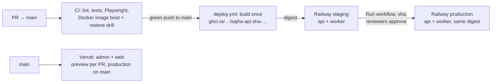

# Deploying Nivra

Phase 9d. **Railway** runs the API, the job worker, Postgres (PostGIS) and Redis. **Vercel** runs the admin panel and the website. **AWS S3** (ap-south-1) holds photos and documents, plus the nightly database backups. GitHub Actions builds one API image per commit and promotes that exact image from staging to production.



Until the accounts and secrets below exist, every deploy step **skips with a notice** and CI stays green. The image is still built and pushed to GHCR on each push to `main`.

## One image, two services

`apps/api/Dockerfile` builds a Node 22 image that runs as the `node` user. It contains the compiled API, the production dependencies and the Prisma CLI (for migrations), and bakes `GIT_SHA` in so `/v1/health` reports the version. Build it locally from the repository root:

```bash
docker build -f apps/api/Dockerfile --build-arg GIT_SHA=$(git rev-parse HEAD) -t sajha-api .
```

| Service | `JOBS_WORKER` | Public domain | Pre-deploy | Health check | Restart |
|---|---|---|---|---|---|
| `api` | `false` | yes (`api.sajha.app`) | `node_modules/.bin/prisma migrate deploy` | `/v1/health` | on failure |
| `worker` | `true` | no | — | `/v1/health` | always, 1 replica |

Both services use the start command `node dist/main.js`. The worker runs the BullMQ jobs: booking timers, emails, the payment sweep and rental reminders. It keeps its HTTP and Socket.IO server so timer-driven updates reach open apps through the Redis adapter, and so Railway can health-check it. **Run exactly one worker.** The jobs are safe to repeat, but one worker is the tested setup.

`apps/api/railway.json` and `apps/api/railway.worker.json` hold these settings as Railway config-as-code. Railway reads config files for services deployed from the repository. For services deployed from an image, as below, enter the same values once in each service's **Settings**. The files are the record of what those settings should be.

## First-time setup

### 1. Railway (per environment: `staging` and `production`)

1. Create a project `sajha` with two environments, `staging` and `production`.
2. Add **Postgres with PostGIS**: use Railway's PostGIS template, version 16 like CI. Turn on Railway's volume backups for production.
3. Add **Redis**.
4. Add two empty services, `api` and `worker`, with **Source → Docker image** `ghcr.io/<owner>/sajha-api:sha-<any built sha>`. The first deploy replaces this with a digest.
   - The GHCR package is private by default. Either add registry credentials in the service settings (a GitHub token with `read:packages`), or make the package public. The image contains no secrets.
5. Enter the settings from the table above. Generate a domain for `api` only, then add `api.sajha.app` (or `api.staging.sajha.app`) as a custom domain.
6. Set the variables below on both services. Railway's shared variables and references save typing, for example `DATABASE_URL=${{Postgres.DATABASE_URL}}`.
7. Create a **project token** for the environment (Project settings → Tokens) and note the environment ID and the two service IDs. They're in the service URL, or press ⌘K → "Copy service ID".

### 2. GitHub (Settings → Environments)

Create the environments `staging` and `production`. On `production`, add **required reviewers**; the promote job waits for their approval.

| Name | Kind | staging | production |
|---|---|---|---|
| `RAILWAY_TOKEN` | secret | staging project token | production project token |
| `RAILWAY_ENVIRONMENT_ID` | variable | ✓ | ✓ |
| `RAILWAY_API_SERVICE_ID` | variable | ✓ | ✓ |
| `RAILWAY_WORKER_SERVICE_ID` | variable | ✓ | ✓ |
| `API_URL` | variable | `https://api.staging.sajha.app` | `https://api.sajha.app` |
| `BACKUP_DATABASE_URL` | secret | — | Postgres public URL (read access is enough) |
| `BACKUP_AWS_ACCESS_KEY_ID` / `BACKUP_AWS_SECRET_ACCESS_KEY` | secret | — | IAM user limited to `s3:PutObject` on the backup prefix |
| `BACKUP_BUCKET` | variable | — | e.g. `sajha-backups` |
| `BACKUP_AWS_REGION` | variable | — | `ap-south-1` (default) |

### 3. Vercel (two projects)

| Project | Root directory | Domain | Variables |
|---|---|---|---|
| `sajha-admin` | `apps/admin` | `admin.sajha.app` | `SAJHA_API_URL`, `SENTRY_DSN`, `NEXT_PUBLIC_SENTRY_DSN`, `NEXT_PUBLIC_SENTRY_ENVIRONMENT` |
| `sajha-web` | `apps/web` | `sajha.app` | `NEXT_PUBLIC_SAJHA_API_URL`, `NEXT_PUBLIC_SITE_URL`, `NEXT_PUBLIC_PLAY_STORE_URL`, `NEXT_PUBLIC_APP_STORE_URL`, Sentry as above |

- **Build settings:** each app's `vercel.json` sets the install and build commands (turbo builds the workspace packages first), region `bom1` (Mumbai), and skips builds that don't touch the app (`turbo-ignore`).
- **Security headers:** HSTS, `nosniff`, frame options, referrer and permissions policies come from each app's `next.config.ts`, so they apply on Vercel and under `next start` alike. The admin panel also sends `X-Robots-Tag: noindex`.
- **Access:** protect the admin project's preview deployments (Vercel Authentication).
- **Launching the apps:** changing a `NEXT_PUBLIC_*` variable needs a redeploy. Set the store URLs and redeploy `sajha-web`, and the waitlist becomes download buttons.

### 4. AWS

Create two buckets in ap-south-1, both with *Block Public Access* on:
- **Media:** public-read photos through `S3_PUBLIC_BASE_URL` (CloudFront recommended).
- **Private documents:** default encryption SSE-KMS, with `S3_PRIVATE_SSE=aws:kms`.

For backups, create a third bucket (or a prefix) with a lifecycle rule: move to Glacier after 30 days, delete after 180.

## API environment variables

Required everywhere unless marked. Staging and production **refuse to boot** with development settings: OTP bypass, console SMS or push, SMTP email, the fake payment provider, an empty or `*` CORS list, unencrypted documents, and Swagger in production (`apps/api/src/config/env.ts`).

| Variable | api | worker | Value in staging / production |
|---|---|---|---|
| `NODE_ENV` | ✓ | ✓ | `staging` / `production` (the image defaults to `production`) |
| `JOBS_WORKER` | `false` | `true` | |
| `DATABASE_URL`, `REDIS_URL` | ✓ | ✓ | Railway references (private network) |
| `CORS_ORIGINS` | ✓ | ✓ | `https://admin.sajha.app,https://sajha.app` |
| `JWT_ACCESS_SECRET`, `JWT_ADMIN_ACCESS_SECRET` | ✓ | ✓ | two different random strings, 32+ characters |
| `OTP_PEPPER` | ✓ | ✓ | random, 32+ characters |
| `TOTP_ENC_KEY`, `ADDRESS_ENC_KEY` | ✓ | ✓ | `openssl rand -base64 32`, one each; **never rotate without a re-encryption plan** |
| `SMS_PROVIDER=msg91`, `MSG91_AUTH_KEY`, `MSG91_OTP_TEMPLATE_ID`, `MSG91_OVERDUE_TEMPLATE_ID` | ✓ | ✓ | DLT-approved templates |
| `PUSH_PROVIDER=fcm`, `FCM_PROJECT_ID`, `FCM_SERVICE_ACCOUNT_JSON` | ✓ | ✓ | Firebase service account (JSON in one line) |
| `EMAIL_PROVIDER=resend`, `RESEND_API_KEY`, `EMAIL_FROM` | ✓ | ✓ | verified sending domain |
| `S3_REGION`, `S3_ACCESS_KEY_ID`, `S3_SECRET_ACCESS_KEY`, `S3_PUBLIC_BUCKET`, `S3_PRIVATE_BUCKET`, `S3_PUBLIC_BASE_URL`, `S3_PRIVATE_SSE=aws:kms` | ✓ | ✓ | leave `S3_ENDPOINT` unset for AWS |
| `PAYMENT_PROVIDER=razorpay`, `RAZORPAY_KEY_ID`, `RAZORPAY_KEY_SECRET`, `RAZORPAY_WEBHOOK_SECRET` | ✓ | ✓ | test keys on staging, live keys on production; webhook URL `https://api…/v1/payments/webhook` |
| `SENTRY_DSN`, `SENTRY_ENVIRONMENT` | ✓ | ✓ | one Sentry project for the API; environment `staging` / `production` |
| `PUBLIC_SITE_URL` | ✓ | ✓ | `https://sajha.app` (invite links; staging: the staging site) |
| `LOG_LEVEL`, `PUBLIC_READ_LIMIT_PER_MIN`, the booking timers | optional | optional | defaults are the tested values |
| `SWAGGER_ENABLED` | staging only | | `true` on staging if you want `/docs`; refused in production |

`GIT_SHA` is set by the image; don't set it by hand. `PORT` comes from Railway.

## Everyday flow

1. **Merge to `main`.** CI runs, and when it's green, `deploy.yml`:
   - builds `ghcr.io/<owner>/sajha-api:sha-<commit>`
   - deploys that digest to staging: `api` first, because its pre-deploy step migrates the database, then `worker`
   - waits for `/v1/health` to report `ok` on that commit

   Vercel deploys admin and web from `main` by itself.
2. **Check staging:** the admin dashboard and a test booking with Razorpay test keys.
3. **Promote:** Actions → **Deploy** → *Run workflow*, with the full commit SHA from the staging summary. After a reviewer approves, the same digest goes to production, is smoke-tested, and is tagged `production` in GHCR.
4. **Roll back:** run the workflow again with the previous good SHA. Migrations only move forward, so a rollback across a migration needs that migration to be backwards compatible. That's the rule for every migration: add columns and tables first, and remove them a release later.

`scripts/railway-deploy.sh` points a service at `image@sha256:…` through Railway's GraphQL API, starts the deployment and waits for `SUCCESS`. It refuses plain tags. `scripts/smoke-test.sh` waits for `/v1/health` to answer `ok` with the expected version. The deploy script was tested against a mock of the API; the first real deploy is its live test.
