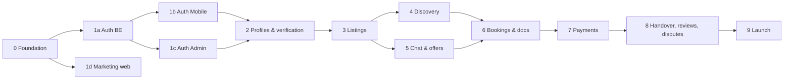

# Sajha — Delivery Phases

We build Sajha in small, reviewable phases. Each phase is delivered in the order **Backend → Mobile → Admin (→ Web)**, and each (sub-)phase lives on its **own branch** and ends with a **commit, a push and a PR into `main`**. See [PLAN §5](./PLAN.md#5-git-workflow).

Related: [PRD](./PRD.md) · [PLAN](./PLAN.md) · [ARCHITECTURE](./ARCHITECTURE.md)

---

## Roadmap

| Phase | Name | Branch | Apps |
|---|---|---|---|
| 0 | Foundation | `phase/0-foundation` | all |
| **1a** | **Auth — Backend** | `phase/1a-auth-backend` | api |
| **1b** | **Auth — Mobile** | `phase/1b-auth-mobile` | mobile |
| **1c** | **Auth — Admin** | `phase/1c-auth-admin` | admin |
| **1d** | **Marketing website v1** | `phase/1d-marketing-web` | web, api (waitlist) |
| 2a | Profiles & verification — API | `phase/2a-profiles-api` | api |
| 2b | Profiles & verification — Mobile | `phase/2b-profiles-mobile` | mobile |
| 2c | Profiles & verification — Admin | `phase/2c-profiles-admin` | admin |
| 3a | Listings & categories — API | `phase/3a-listings-api` | api |
| 3b | Listings & categories — Mobile | `phase/3b-listings-mobile` | mobile |
| 3c | Listings & categories — Admin | `phase/3c-listings-admin` | admin |
| 4a | Discovery & search — API | `phase/4a-discovery-api` | api |
| 4b | Discovery & search — Mobile | `phase/4b-discovery-mobile` | mobile |
| 5 | Chat, offers & notifications | `phase/5-chat-offers` | api, mobile, admin |
| 6 | Bookings & document sharing | `phase/6-bookings` | api, mobile, admin |
| 7 | Payments & payouts | `phase/7-payments` | api, mobile, admin |
| 8 | Handover, return, reviews & disputes | `phase/8-handover-reviews-disputes` | api, mobile, admin |
| 9 | Launch hardening & release | `phase/9-launch` | all |

Larger phases (3, 5, 6, 7, 8) may also be split into `-api`, `-mobile` and `-admin` sub-branches, like Phase 1, if the PR gets too big to review.

## Definition of done (every phase)

- [ ] All acceptance criteria for the phase are met
- [ ] Lint, typecheck, tests and build are green locally and in CI
- [ ] New endpoints are documented in Swagger; `.env.example` is updated
- [ ] README or app README explains how to run the new work
- [ ] **Final commit made** (Conventional Commit message)
- [ ] **Branch pushed** with `git push -u origin phase/<…>` — **never to `main`**
- [ ] **PR opened into `main`**, with a summary, run steps and the checked acceptance list
- [ ] The next phase starts from `main` only after this PR is merged

---

## Phase 0 — Foundation
**Branch:** `phase/0-foundation`

**Scope**
- Monorepo: pnpm workspaces, Turborepo, shared `tsconfig` and `eslint-config`, Prettier, Husky + lint-staged, `.editorconfig`, `.nvmrc`
- `infra/docker-compose.yml`: PostGIS 16, Redis 7, SeaweedFS as local S3 (buckets created on start), Mailpit
- `apps/api`: NestJS skeleton, config module with env validation, Prisma set up with the first migration (extensions: `postgis`, `btree_gist`, `citext`), `/health` endpoint, pino logging, Swagger at `/docs`, global validation pipe and error filter, Vitest unit + e2e setup with Testcontainers
- `apps/mobile`: Flutter skeleton with Android flavors (dev/staging/prod) and `config/<env>.json` build config, folder structure, Riverpod, go_router, dio client, theme from design tokens, one sample shader compiled and rendered
- `apps/admin`, `apps/web`: Next.js skeletons with Tailwind; shadcn/ui initialised in admin
- `packages/design-tokens`: colours, typography and radii → a Tailwind preset and a generated Dart theme file
- GitHub Actions CI: JS job (lint, typecheck, test, build via Turbo) + Flutter job (analyze, test)
- Start external account setup: MSG91 DLT templates, Resend domain, Razorpay test account, Firebase project

**Acceptance criteria**
- `docker compose -f infra/docker-compose.yml up -d` then `pnpm dev` starts the API at `:3000` (the `/health` check returns ok), admin at `:3001` and web at `:3002`
- `flutter run --flavor dev --dart-define-from-file=config/dev.json` launches the app with a shader splash placeholder
- `pnpm lint && pnpm test && pnpm build` pass; the CI workflow is green on the PR

---

## Phase 1a — Auth: Backend
**Branch:** `phase/1a-auth-backend` · Design: [ARCHITECTURE §4](./ARCHITECTURE.md#4-authentication--authorization)

**Scope**
- Prisma models: `User`, `AdminUser`, `AdminRecoveryCode`, `Session` + `RefreshToken` (shared by both realms), `OtpChallenge`, `AuditLog`
- `providers/sms` (`Msg91SmsProvider`, `ConsoleSmsProvider`), `providers/email` (`ResendEmailProvider`, `MailpitEmailProvider`) plus email OTP template
- `otp` module: create and verify challenges, HMAC hashing, TTL, attempt limits, cooldown, Redis rate limits
- `auth` module: phone OTP login/signup, email OTP verify, JWT access token, rotating refresh token with reuse detection, logout, logout-all
- `users` module: `GET/PATCH /v1/me`, sessions list and revoke, account deletion request
- `admin-auth` module: login → mandatory TOTP setup/verify → tokens; recovery codes; lockout; `AdminJwtGuard` + `@Roles`
- `admin` module (Phase 1 part): manage admin users (Super Admin only); read-only app-user list
- `audit` module: log admin auth events and admin mutations
- `seed:admin` CLI to create the first Super Admin
- Swagger docs for every endpoint listed in ARCHITECTURE §4

**Acceptance criteria**
- [ ] Request OTP → the code appears in the console provider (dev) → verify returns tokens and `isNewUser: true` on first login and `false` afterwards
- [ ] Wrong code 5 times → `OTP_TOO_MANY_ATTEMPTS`; expired → `OTP_EXPIRED`; request again within 30s → `OTP_COOLDOWN`; the 6th request in an hour → `OTP_RATE_LIMITED`
- [ ] Email OTP sets `emailVerifiedAt`; an email already used by another user → `EMAIL_IN_USE`; the email arrives in Mailpit
- [ ] Refresh rotates tokens; reusing an old refresh token → `REFRESH_REUSED` and the whole family is revoked
- [ ] Logout invalidates the refresh token; logout-all kills every session
- [ ] A suspended user can't log in or refresh
- [ ] Admin: a correct password without 2FA gives no tokens; first login forces TOTP setup; 5 wrong passwords → locked out for 15 minutes; OPS can't reach Super Admin endpoints (`403`)
- [ ] OTP codes, tokens and phone numbers never appear in logs
- [ ] Unit tests for the OTP service, token service and guards; e2e tests for every endpoint above; coverage of the auth modules ≥ 80% (`pnpm --filter @sajha/api test:cov` enforces it in CI)

**Final commit:** `feat(auth-api): phone & email OTP, JWT refresh rotation, admin auth with TOTP & RBAC`

---

## Phase 1b — Auth: Mobile
**Branch:** `phase/1b-auth-mobile` (after 1a is merged)

**Screens**
1. **Splash**: animated shader background (GLSL aurora/gradient mesh) plus the logo animation; checks the stored session
2. **Onboarding**: 3 slides (Borrow / Lend / Trust) with `flutter_animate` transitions; skip option
3. **Phone entry**: fixed +91 prefix, 10-digit validation, terms and privacy consent checkbox, uiverse-style animated CTA
4. **OTP**: 6-box input with keyboard auto-fill (`AutofillHints.oneTimeCode`: iOS and Gboard suggest the code from the SMS), resend countdown (30s), error shake animation, attempts-left message. Android SMS Retriever (fully automatic fill) needs the app hash in the DLT SMS template, so it's added once MSG91 is live.
5. **Profile setup** (new users only): name
6. **Email entry → email OTP** (the same OTP widget); can be skipped for browsing, but it's required before listing or booking
7. **Home placeholder** with the verified badges shown and a logout button
8. **Settings → Active sessions** (list and revoke), **Logout**, **Logout all devices**, **Delete account**

**Technical scope**
- `features/auth` data, application and presentation layers; `AuthController` state machine
- `flutter_secure_storage` for the refresh token; access token in memory
- dio `AuthInterceptor` + `TokenManager` (single-flight refresh, retries the failed request, signs out when the server ends the session)
- go_router redirects: unknown → splash, unauthenticated → onboarding (first time) or phone, no name → name setup, email not verified → email step (skippable)
- Maps API error codes to friendly messages
- Stable device ID generated and persisted at first launch
- `effects/`: reusable `ShaderBackground` widget, `AnimatedGradientButton`, `OtpField`, loading shimmer

**Acceptance criteria**
- [ ] A new user completes phone → OTP → name → email → email OTP and lands on Home with both badges
- [ ] An existing user logs in with phone + OTP only
- [ ] Killing and reopening the app keeps the user logged in; after the access token expires, requests refresh silently
- [ ] A revoked session (from another device) sends the user to login on the next API call
- [ ] Every API error code shows a clear message; OTP auto-fill works on an Android device
- [ ] Shader background runs at 60fps on a mid-range Android device; reduced-motion settings disable animations
- [ ] Widget tests for the phone, OTP and email screens; unit tests for `AuthController` and the refresh interceptor; `flutter analyze` is clean

**Final commit:** `feat(mobile-auth): onboarding, phone & email OTP, session handling with shader UI`

---

## Phase 1c — Auth: Admin
**Branch:** `phase/1c-auth-admin` (after 1a is merged)

**Screens**
1. **Login**: email + password (subtle shader/uiverse background on this screen only)
2. **2FA setup** (first login): QR code, verify code, show and download recovery codes
3. **2FA verify** (later logins), with a "use a recovery code" option
4. **Dashboard shell**: sidebar (role-aware), top bar with the admin's name and role, logout
5. **Admins** (Super Admin): list, invite (email + role → temporary password shown once), change role, disable
6. **Users** (read-only): table of app users with search by phone or email, verification badges and created date
7. **My account**: change password, active sessions

**Technical scope**
- Server Functions for login, 2FA and admin actions set and clear httpOnly cookies; `proxy.ts` refreshes tokens before pages render; `/logout` route handler
- `proxy.ts` (Next.js 16's renamed Middleware) protects `(dashboard)` routes
- `@sajha/api-client` generated from the API's OpenAPI spec
- shadcn/ui forms (`useActionState` + server-side validation from the API) and server-rendered tables

**Acceptance criteria**
- [ ] A seeded Super Admin logs in, sets up TOTP, and reaches the dashboard
- [ ] No token is readable from JS (`document.cookie` doesn't contain it)
- [ ] An OPS admin doesn't see the "Admins" nav item and gets a 403 page on direct URL access
- [ ] The session survives a page reload; logout clears it
- [ ] Playwright test: login → 2FA (using a TOTP generated from a test secret) → dashboard → logout

**Final commit:** `feat(admin-auth): admin login with TOTP 2FA, RBAC shell, admin & user lists`

---

## Phase 1d — Marketing website v1
**Branch:** `phase/1d-marketing-web` (can run in parallel with 1b/1c after Phase 0)

**Scope**
- Landing page sections from [PRD §9](./PRD.md#9-marketing-website): Hero, How it works (Borrower/Lender tabs), Categories, Why Sajha, Trust & safety, Become a lender (earnings calculator), FAQ, Waitlist/Download, Footer
- **Effects:**
  - **Paper Shaders** (`@paper-design/shaders-react`, Apache-2.0): animated hero background, with a static gradient poster fallback. shaders.com was the original choice, but it needs a paid Pro/Team license for any public commercial site
  - **React Bits**: split/blur text headline, spotlight or tilted category cards, animated counters, magnet CTA button
  - **uiverse.io**: CTA buttons, toggles for the Borrower/Lender tab, loader on waitlist submit
- Pages: `/`, `/how-it-works`, `/lend`, `/faq`, `/privacy`, `/terms`, `/contact`
- SEO: metadata, Open Graph images, sitemap, robots.txt
- API: `waitlist` module with `POST /v1/waitlist` (email, city, role, utm; rate limited, honeypot); admin CSV export endpoint

**Acceptance criteria**
- [ ] Lighthouse mobile scores: Performance ≥ 85, Accessibility ≥ 95, SEO ≥ 95
- [ ] `prefers-reduced-motion` disables shaders and animations
- [ ] The waitlist form saves to the DB and shows success, and a duplicate email shows a friendly message
- [ ] Responsive from 360px to 1440px
- [ ] Playwright smoke test: page loads, waitlist submits

**Final commit:** `feat(web): marketing landing with shader hero, React Bits & uiverse effects, waitlist`

---

## Phase 2 — Profiles & verification
Delivered as three sub-phases, each with its own branch and PR. **Done when:** a user uploads an ID, an admin approves it, and the ID badge shows in the app; every document view appears in the audit log.

**Decisions:** the ID badge is earned by **any** admin-approved, non-expired document (college and employee IDs count). The profile stores the **city only**; GPS pickup location arrives with listings in Phase 3.

### 2a — API
**Branch:** `phase/2a-profiles-api`

- `profiles` (name, city, bio, avatar); `user_documents` vault (PENDING/APPROVED/REJECTED; one live document per type)
- Uploads: `POST /v1/uploads` presigned PUT to a `tmp/` key in the private bucket (the type and size are signed). The server finalises by checking magic bytes and re-encoding with sharp (EXIF/GPS stripped): avatar → 512 px WebP in the public bucket, document → JPEG in the private bucket
- `GET/PATCH /v1/me` returns `city`, `bio`, `avatarUrl` and `idVerified`; `PUT/DELETE /v1/me/avatar`; `/v1/me/documents` (list, add, 5-minute signed view, delete)
- Admin: `/v1/admin/documents` queue, view, approve and reject (SUPER_ADMIN, OPS); `GET /v1/admin/users/:id` detail; suspend, ban and reactivate (revokes sessions)
- Every upload, view and review is audited. `VerifiedGuard` / `@RequireVerified()` are ready for Phase 3 routes
- **Done when:** e2e against real Postgres, Redis and SeaweedFS covers presign → PUT → finalise, the document lifecycle and the badge, privacy and RBAC, and suspend/ban; coverage ≥ 80%; the OpenAPI client is regenerated

### 2b — Mobile
**Branch:** `phase/2b-profiles-mobile`

- Profile view and edit (avatar crop and upload, name, city, bio), badges row (Phone / Email / ID)
- "My documents": list with status and rejection reason, add flow with masked-Aadhaar guidance, view, delete
- Uploads go through `UploadClient`: a presigned PUT on a separate, token-free HTTP client
- **Done when:** widget tests cover the avatar and add-document flows, and the live contract test does a real upload

### 2c — Admin
**Branch:** `phase/2c-profiles-admin`

- Document review queue and review page (the image streams through the admin server, so the storage URL never reaches the browser; watermark; approve, or reject with a reason)
- User detail page (profile, badges, documents, sessions, activity) with suspend, ban and reactivate
- CI's browser e2e job runs real storage (SeaweedFS) and the OTP bypass, so the suite uploads through presigned URLs like the app does
- **Done when:** Playwright approves a document and the user's `idVerified` flips to true; SUPPORT gets 403 on documents

**Later:** purging rejected documents after 30 days (BullMQ jobs, Phase 5), `FLAG_SECURE` when lenders view documents (Phase 6), PDF documents.

## Phase 3 — Listings & categories
Delivered as three sub-phases, each with its own branch and PR. **Done when:** a lender publishes a listing with required docs, and it shows as LIVE after moderation.

**Decisions:**
- **Moderation:** a lender's **first** listing is reviewed by an admin. Once a lender has an approved listing, their later listings go LIVE immediately. Admins can unpublish anything.
- **Location:** OpenStreetMap (`flutter_map`) with a draggable pin from GPS. The tile server is configurable.
- **Weekly pricing:** a weekly discount % (0–50) for 7+ days.
- **Limits:**
  - ₹10–₹10,000 per day
  - deposit ₹0–₹50,000
  - 1–90 days
  - advance notice 0–7 days
  - 1–8 photos
- **Commission:** 10%, served by `GET /v1/config`.

### 3a — API
**Branch:** `phase/3a-listings-api`

- `categories` (admin-managed; 9 launch categories seeded). Public `GET /v1/categories`; admin create, edit, hide and reorder.
- `listings`:
  - draft → publish (PENDING or LIVE) → pause/unpause → delete
  - admin approve, reject, unpublish and change category
  - public `GET /v1/listings/:id` with an approximate location (~1 km)
- `listing_photos`: presigned upload (`LISTING_PHOTO`), re-encoded into a 1600 px WebP and a 480 px thumbnail WebP (synchronous; BullMQ comes in Phase 5)
- `availability_blocks` (inclusive date ranges) and `listing_required_docs`
- Exact address encrypted with AES-256-GCM (`ADDRESS_ENC_KEY`). `location geography(Point)` is kept in sync by a trigger, with a GIST index for Phase 4.
- `@RequireVerified()` on create and publish; everything audited
- **Done when:** e2e covers the moderation rule, the photos, blocks and docs, public privacy, and deletion; coverage ≥ 80%; the OpenAPI client is regenerated

### 3b — Mobile
**Branch:** `phase/3b-listings-mobile`

- Create/edit listing wizard: photos → details → pricing (earnings preview) → availability → location on the map → required docs → preview → publish
- "My listings": status, reasons, pause/unpause, edit, delete
- **Done when:** widget tests cover the wizard through "Sent for review", and the live contract test publishes a real listing

### 3c — Admin
**Branch:** `phase/3c-listings-admin`

- Listing moderation queue and detail: approve, reject, unpublish, change category
- Category management
- The user page lists the user's listings
- **Done when:** Playwright approves a first listing that then appears publicly, the lender's second listing goes live without review, and Support gets 403

## Phase 4 — Discovery & search
Delivered as two sub-phases, each with its own branch and PR. **Done when:** a borrower finds items within 5 km that are free on their dates, sorted by distance.

**Decisions:**
- **Guests can browse** home, search and listing detail; sign-in is asked for at save, chat and book.
- **Search area:** GPS, or a spot picked on the OpenStreetMap map. 5 km by default, 1–25 km.
- **"Popular this week":** views (one per viewer per day) + 3× wishlist saves over 7 days.
- **Distances** are rounded to 0.5 km, and anything under 1 km reads "< 1 km".
- **Rental days are inclusive:** pickup day to return day.
- **Recently viewed** is kept on the device.

### 4a — API
**Branch:** `phase/4a-discovery-api`

- `GET /v1/search`:
  - keywords: Postgres full text, `english` stemming, weighted title > brand/category > description
  - `lat`/`lng`/`radiusKm`: PostGIS `ST_DWithin` on the GIST index
  - dates: free of blocked dates, within min/max days and advance notice
  - filters: category, price range, condition, verified lenders only
  - sort by distance, relevance, price or newest
  - keyset cursor paging
- `GET /v1/home` (categories, near you, popular this week, newest), `GET /v1/listings?ids=` (cards), `GET /v1/listings/:id/quote`
- Wishlist: `/v1/me/favorites`. Listing views are counted on the public detail; guests are keyed by a salted hash, with no raw IP stored.
- An optional sign-in guard personalises public routes (saved flags); a stale token gets 401, never a silent guest.
- **Done when:** e2e covers radius and distance order, stemming, date availability, filters, paging, privacy (no coordinates), the wishlist, view dedupe and popular ranking, and quotes; coverage ≥ 80%.

### 4b — Mobile
**Branch:** `phase/4b-discovery-mobile`

- Guest browsing, a search area (GPS or map), the home feed, search with filters and a date picker, and listing detail with a price breakdown and the lender mini-profile
- Wishlist, and recently viewed
- **Done when:** widget tests cover the guest → sign-in-to-save flow, filters, the dates quote and the wishlist, and the live contract test searches the local API

## Phase 5 — Chat, offers & notifications
**Branch:** `phase/5-chat-offers`

- **API:** `chat` (REST + Socket.IO gateway, Redis adapter), `offers` (offer, counter, accept, decline, expire), contact masking, `notifications` module (FCM, email), device tokens
- **Mobile:** inbox, chat screen (text, image, offer cards, typing, read receipts), push notifications with deep links, report/block user
- **Admin:** view a conversation from a report (read-only, logged)
- **Done when:** two devices chat in realtime, negotiate an offer, and the accepted offer creates a booking request stub; phone numbers in chat are masked

## Phase 6 — Bookings & document sharing
**Branch:** `phase/6-bookings`

- **API:** `bookings` state machine (REQUESTED → … → CONFIRMED, excluding payment capture), exclusion constraint, BullMQ expiry jobs, `booking-documents` (share from vault, lender approve or reject, time-boxed access, access logs, purge job), cancellation policy
- **Mobile:** request to book, lender accept/decline, document request and submit flow, lender document viewer (watermarked, `FLAG_SECURE`), "My bookings" (borrowing and lending tabs) with a timeline
- **Admin:** bookings list and detail with event timeline; cancel with a reason
- **Done when:** a booking on a listing that requires documents goes through accept → borrower shares ID → lender approves → AWAITING_PAYMENT; overlapping requests can't both reach AWAITING_PAYMENT

## Phase 7 — Payments & payouts
**Branch:** `phase/7-payments`

- **API:** Razorpay orders, client verify, webhooks (signature and idempotency), ledger, refunds, cancellations with the refund policy, Route linked-account onboarding for lenders, on-hold transfers, deposit hold and refund
- **Mobile:** checkout (`razorpay_flutter`), payment status screens, lender payout setup, earnings screen
- **Admin:** payments, refunds, payouts, ledger and reconciliation view; manual refund (Super Admin/Ops)
- **Done when:** in Razorpay test mode, pay → CONFIRMED via webhook; cancellation refunds follow the policy; the ledger balances

## Phase 8 — Handover, return, reviews & disputes
**Branch:** `phase/8-handover-reviews-disputes`

- **API:** handover and return codes (QR + 6-digit OTP), condition reports, rental reminders, late fees, claim window, payout release and deposit refund on COMPLETED, `reviews` (double-blind), `disputes`, `reports`
- **Mobile:** handover/return screens (show QR, scan QR, photo capture), late-return banner, rate and review screen, raise a dispute with evidence, report listing
- **Admin:** dispute workspace (timeline, condition photos side by side, chat excerpt, decision with a deposit capture amount), reports queue
- **Done when:** a full rental runs end to end in test mode: request → pay → handover → return → review → payout released and deposit refunded; a disputed rental is resolved by an admin with a partial capture

## Phase 9 — Launch hardening & release
**Branch:** `phase/9-launch`

- Admin analytics dashboard (signups, listings, bookings, GMV, disputes)
- Notification preferences; email templates polished
- Security review (OWASP ASVS L1 checklist), load test of the search and chat endpoints, backups and restore drill
- Crash reporting (Sentry / Crashlytics), app store assets, privacy nutrition labels, Play Store Data Safety form, account-deletion URL
- Production infrastructure, staging → production promotion, monitoring alerts
- Marketing site: switch the waitlist to download links, blog/SEO pages
- **Done when:** the apps are live on the Play Store (and the App Store), with production monitoring in place
