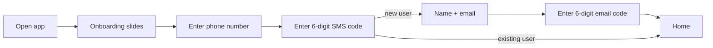
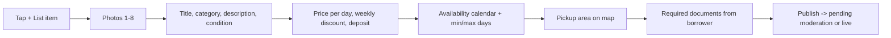
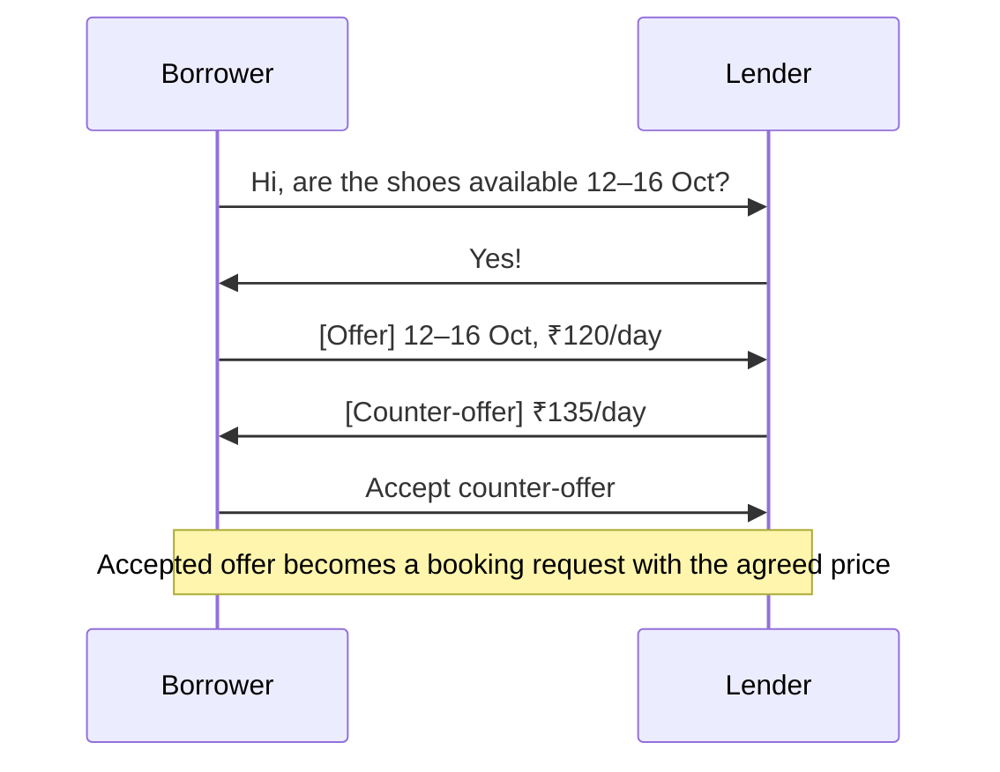
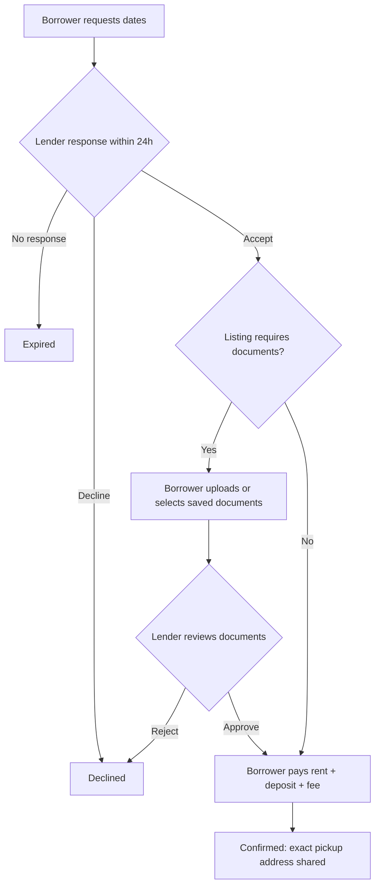
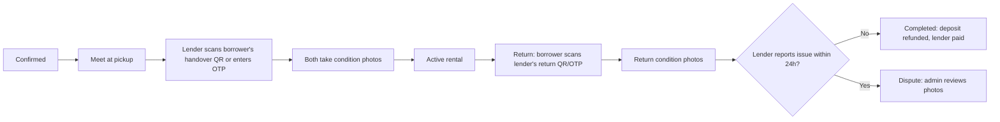

# Sajha — Product Requirements Document (PRD)

> **Sajha** (साझा) means *shared*. Sajha is a peer-to-peer rental marketplace where people lend the things they rarely use and borrow the things they need only for a short time.

| | |
|---|---|
| **Status** | Draft v1 — for review |
| **Market** | India (launch city TBD), currency INR |
| **Apps** | Mobile app (Flutter, Android + iOS), Admin panel (Next.js), Marketing website (Next.js), Backend API (NestJS) |
| **Related docs** | [PLAN](./PLAN.md) · [ARCHITECTURE](./ARCHITECTURE.md) · [PHASES](./PHASES.md) |

---

## 1. Problem & vision

**Problem.** Many useful things are expensive to buy but used rarely. A pair of trekking shoes, a tent, a DSLR, a drill or a party speaker can sit in a cupboard for 11 months of the year. At the same time, other people:

- **can't afford** to buy the item, or
- **need it only once or for a short time** (one trek, one wedding, one weekend project).

**Vision.** Sajha lets an owner earn from idle things and lets someone who needs them rent them cheaply, safely and nearby.

**Example.** Aman bought trekking shoes and treks once a year. Rahul is going on his first trek and doesn't want to spend ₹6,000 on shoes. Aman lists the shoes on Sajha at ₹150/day with a ₹1,000 refundable deposit. Rahul books them for 5 days, pays ₹750 rent plus the deposit, picks them up, treks, and returns them. Aman earns ₹675 after the platform fee, and Rahul gets his deposit back.

## 2. Goals & non-goals

**Goals (MVP)**
1. Lenders can list an item in under 3 minutes.
2. Borrowers can find nearby items that are available on their dates.
3. Borrowers and lenders can chat and negotiate price and availability.
4. Bookings are paid safely, with a refundable security deposit.
5. Both sides can trust each other through verified phone and email, requested documents, condition photos and reviews.
6. Admins can moderate users, listings, documents, bookings and disputes.

**Non-goals (MVP)**
- Delivery logistics. Pickup and drop are arranged between users. A delivery partner integration comes later.
- Insurance products.
- Business/rental-shop accounts. MVP is peer-to-peer only.
- Web app for renting. Renting happens only in the mobile app; the website is for marketing.
- Multi-country or multi-currency support.

## 3. Personas

| Persona | Description | Needs |
|---|---|---|
| **Lender — Aman (29, working professional)** | Owns trekking shoes, a tent and a DSLR that he rarely uses | Earn something, trust the borrower, get items back in good condition, simple listing |
| **Borrower — Rahul (21, student)** | Going on one trek, tight budget | Cheap, nearby, available on his dates, a clear total cost, deposit returned |
| **Borrower — Priya (34, occasional DIY)** | Needs a drill for a weekend | Quick availability, easy pickup |
| **Admin / Ops — Sajha team** | Runs the marketplace | Moderate content, review documents, resolve disputes, manage payouts, keep the platform safe |

## 4. Launch categories

Trekking & outdoor gear · Cameras & electronics · Tools & DIY · Sports & fitness · Party & event items · Travel bags & luggage · Books & study material · Baby & kids gear · Costumes & ethnic wear.

Categories are managed by admins, so this list can change without an app release.

## 5. Core user journeys

### 5.1 Sign up / log in

- Login is by **phone number + SMS OTP**. There are no passwords for app users.
- New users add their **name and email**, and verify the email with a **6-digit email code**.
- A user gets **verified badges** for phone and email, and later for ID (Phase 2).
- Browsing is allowed before email verification. **Listing or booking requires a verified phone and a verified email.**

### 5.2 List an item (lender)

Listing fields:
- Photos (1–8), title, category, description, condition (New / Like new / Good / Fair), brand, size (optional)
- **Price per day** (INR), optional **weekly price** or percentage discount for 7+ days
- **Refundable security deposit** (INR)
- **Availability**: blocked dates, minimum and maximum rental days, advance notice (for example, 1 day)
- **Pickup location**: approximate area shown publicly; the exact address is shared only after a booking is confirmed
- **Required documents** (optional, chosen by the lender): Government ID (Aadhaar / PAN / Driving Licence / Passport / Voter ID), College or Employee ID, Address proof, or Other (with a free-text description)
- Instant-book on/off (Later; MVP always requires the lender's acceptance)

### 5.3 Discover (borrower)

- Home: categories, "Near you", "Popular this week", recently viewed
- Search by keyword, with filters for category, price range, distance radius, **dates available**, condition and verified lenders only
- Sort by distance, price or rating
- Listing detail: photos, price breakdown for the selected dates, deposit, lender profile and rating, required documents, approximate location, and "Chat" and "Request to book" buttons

### 5.4 Chat & negotiate

- One chat thread per borrower–listing pair
- Text messages, images and structured **Offer** cards (dates + price per day). An offer can be accepted, countered or declined.
- Accepting an offer creates a **booking request** at the agreed price
- Read receipts, typing indicator, and push notifications when the recipient is offline
- **Safety:** phone numbers, emails and payment handles typed into chat are masked until the booking is confirmed, so users don't take deals off-platform. Users can report or block from the chat screen.

### 5.5 Book, share documents & pay

- The price breakdown always shows **rent × days**, **platform fee**, **refundable deposit** and the **total**
- Payment is through **Razorpay** (UPI, cards, net banking), with payment windows (for example, 2 hours after acceptance)
- **Documents requested by the lender:**
  - The borrower can reuse a document already saved in their **document vault** or upload a new one
  - The document is shared with **that lender, for that booking only**
  - The lender can view it (without downloading) only while the booking is between accepted and returned
  - Access ends automatically when the booking closes, and shared copies are **purged after a retention window** (for example, 30 days) unless there is an open dispute
  - Every view is logged, and the borrower can see who viewed their document and when

### 5.6 Handover & return

- A handover code confirms that the item changed hands, and the rental clock starts
- Condition photos at handover and return are the evidence used in any dispute
- **Late return:** a late fee of 1× the daily rate per late day, charged from the deposit, with reminders at T-1 day, on the due day, and when overdue
- Payout to the lender and deposit refund to the borrower happen after the return window closes with no dispute

### 5.7 Reviews

- After completion, both sides rate each other (1–5 stars plus an optional comment); the lender's rating also counts toward the item
- Reviews are published when both have submitted or after 7 days (double-blind), to avoid retaliation

## 6. Feature list

### 6.1 Requested by the product owner
| Feature | Summary | Phase |
|---|---|---|
| Phone OTP verification | Login/sign-up with SMS code | 1 |
| Email OTP verification | Verify email with a 6-digit code | 1 |
| Chat to discuss rate & availability | Realtime chat with offer/counter-offer cards | 5 |
| Lender-requested documents | Listing can require documents; the borrower shares them for one booking only | 3 (flags), 6 (sharing) |
| Admin panel | Manage users, listings, bookings, disputes | 1 onward |
| Marketing website with rich UI effects | uiverse, shaders.com and React Bits effects | 1d |

### 6.2 Recommended additions
| Feature | Why | Priority |
|---|---|---|
| Refundable security deposit | Protects lenders; key to trust | **MVP** |
| Handover & return OTP/QR + condition photos | Proof of exchange and condition for disputes | **MVP** |
| Availability calendar with blocked dates | Prevents clashes and wasted requests | **MVP** |
| Verified badges (phone, email, ID) | Visible trust signals | **MVP** |
| Two-way reviews | Reputation for both sides | **MVP** |
| Push notifications | Timely responses; bookings expire otherwise | **MVP** |
| Report / block user & listing | Safety | **MVP** |
| Late-return fee rule | Fairness to lenders | **MVP** |
| Lender earnings & payout screen | Lender motivation and transparency | **MVP** |
| Personal document vault | Upload an ID once and reuse it across bookings | **MVP** |
| Contact masking in chat before confirmation | Keeps transactions on-platform and safe | **MVP** |
| "Request an item" board | Borrowers post needs ("need a tent 12–15 Oct in Pune") and lenders respond | Later |
| Wishlist & saved searches with alerts | Re-engagement | Later |
| DigiLocker-based KYC | Stronger ID verification | Later |
| Damage protection add-on | Optional small fee to cover damage | Later |
| Delivery partner integration (Dunzo / Porter / Shadowfax) | Convenience | Later |
| Referral credits | Growth | Later |
| Hindi and regional-language localisation | Reach | Later |
| Bundles (e.g., "Trek kit" = shoes + poles + bag) | Higher order value | Later |
| Instant book for trusted borrowers | Faster conversion | Later |

## 7. Business rules (proposed defaults — to be confirmed)

| Rule | Proposed default |
|---|---|
| Platform commission | **10%** of rent, deducted from the lender payout |
| Borrower service fee | ₹0 for MVP (configurable) |
| Security deposit | Set by the lender; suggested at 20–50% of the item's value; fully refundable |
| Lender response window | 24 hours, then the request expires |
| Payment window after acceptance | 2 hours |
| Cancellation by borrower | Full refund more than 48h before start; 50% of rent 24–48h before; no rent refund under 24h. The deposit is always refunded. |
| Cancellation by lender | Full refund to the borrower; the lender's cancellation count is shown and penalised |
| Late return | 1× daily rate per late day, taken from the deposit |
| Damage claim window | 24 hours after return |
| Minimum age | 18 |
| Rental length | Minimum 1 day; the maximum is set by the lender (default 30 days) |
| Prohibited items | Weapons, drugs, alcohol, medicines, vehicles requiring registration (MVP), live animals, counterfeit or stolen goods, adult content, hazardous materials |

## 8. Admin panel capabilities

| Area | Capabilities |
|---|---|
| Auth & roles | Email + password + TOTP 2FA; roles **Super Admin**, **Ops**, **Support**; admin user management |
| Dashboard | Signups, listings, bookings, GMV, disputes, pending queues |
| Users | Search, view profile, verification status, bookings, reports; suspend, ban or unban |
| Documents / KYC | Review queue for vault documents; approve or reject with a reason (view-only, access logged) |
| Listings | Moderation queue; approve, reject or unpublish; edit category |
| Categories | Create, edit, reorder and set an icon |
| Bookings | Search and view the timeline; cancel with a reason |
| Payments & payouts | Payments, refunds, payouts and the ledger; retry failed payouts |
| Disputes | View evidence (condition photos, chat); decide the outcome (full or partial deposit capture) |
| Reports | User and listing reports queue |
| Content | Marketing FAQs and waitlist export |
| Audit log | Every admin action and every document view |

## 9. Marketing website

**Purpose:** explain Sajha, build trust, collect a waitlist before launch, and drive app installs.

Sections:
1. **Hero** with an animated shader background (shaders.com), animated headline (React Bits text effects), and CTA buttons (uiverse)
2. **How it works**, with borrower and lender tabs
3. **Categories** grid, with hover effects
4. **Why Sajha**: save money, earn from idle things, sustainability
5. **Trust & safety**: verification, deposits, documents, reviews
6. **Become a lender**: an earnings calculator
7. **Testimonials** or early-user quotes
8. **FAQ**
9. **Waitlist / download** buttons for the Play Store and App Store
10. Footer: About, Terms, Privacy, Contact

## 10. Notifications (MVP)

| Event | Push | Email | SMS |
|---|---|---|---|
| OTP | – | ✓ (email code) | ✓ (phone code) |
| New chat message | ✓ | – | – |
| Booking requested / accepted / declined / expired | ✓ | ✓ | – |
| Documents requested / approved | ✓ | – | – |
| Payment success / refund | ✓ | ✓ | – |
| Pickup reminder / return reminder / overdue | ✓ | – | ✓ (overdue only) |
| Dispute opened / resolved | ✓ | ✓ | – |

## 11. Compliance, privacy & safety

- **DPDP Act 2023 (India):** explicit consent for collecting documents, purpose limitation (only for the booking), right to deletion (account deletion flow), a named grievance officer, and a privacy policy.
- **Aadhaar:** we never store full Aadhaar numbers as data. Uploaded Aadhaar images are prompted to be **masked Aadhaar** (last 4 digits only).
- **Payments:** handled by Razorpay (PCI-DSS). Sajha never stores card or UPI credentials.
- **Documents:** encrypted at rest, private storage, short-lived view links, access logs, and automatic purge.
- **Terms of use:** users are responsible for items; Sajha is an intermediary.
- **Account deletion:** in-app, as required by the Play Store and App Store.

## 12. Success metrics

| Metric | Target (first 6 months after launch) |
|---|---|
| Live listings in launch city | 1,000 |
| Request → confirmed booking conversion | ≥ 35% |
| Booking completion rate (confirmed → completed) | ≥ 90% |
| Dispute rate | ≤ 3% of completed bookings |
| Lender response within 24h | ≥ 80% |
| D30 retention | ≥ 25% |
| Average rating | ≥ 4.3 |

## 13. Open questions

1. Launch city (Pune / Bengaluru / Delhi NCR / Dehradun, a trekking hub)?
2. Final commission and whether to charge borrowers a service fee.
3. Should listings require admin approval before going live, or go live immediately with post-moderation?
4. Deposit caps and whether the platform suggests the deposit from the category and item value.
5. Is ID verification (Phase 2) mandatory for borrowers above a deposit or item-value threshold?
6. Brand assets: logo, colours and typography.
